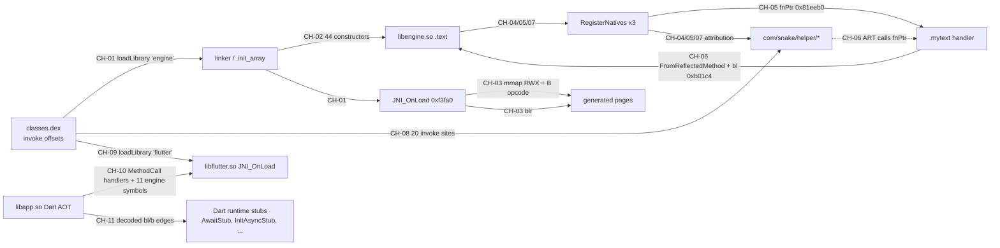

# SNAKE.apk — call linkage (สายการเรียก)

`LINKAGE.md` ตอบว่า *ข้อเท็จจริงใน fragment ไหนพูดถึงเรื่องเดียวกัน* เอกสารนี้ตอบคำถามถัดไป:
**instruction ที่ offset ไหน ในโมดูลไหน โอน control ไปยังอะไร** — เรียงเป็นสายการเรียกตั้งแต่
`invoke` ฝั่ง Dalvik ที่โหลด `libengine.so` ลงไปถึง `blr` ที่หลุดออกจาก image แบบ static
และข้ามไปยัง call edge ของ Dart AOT snapshot

> **ดูเพิ่ม:** `BOOT_LINKAGE.md` (แกน `SP-01`) เอา chain ในเอกสารนี้ (CH-01..CH-12) ไปประกอบกับ tier เฟรมเวิร์ก (fragment F9) และ tier ใหม่ฝั่ง Dart (T4) เป็นแกนเดียวตั้งแต่ process boot จนถึง `https://rest.snakeseller.com/api/request/` สร้างด้วย `tools/build_boot_linkage.py`

ทุก hop ผูกกับ *offset ของ instruction ฝั่งผู้เรียก* (`module+offset`) และอ้างบรรทัดของ fragment
ที่อ่านมาเสมอ ถ้าหาชื่อ callee จากหลักฐานที่ commit ไว้ไม่ได้ แถวนั้นจะยังอยู่ ทำเครื่องหมาย
`(unresolved)` และระบุวิธีปิดไว้ด้วย — เป้าหมายที่หายไปคือข้อมูล ไม่ใช่เหตุผลให้ทิ้งแถว

เอกสารเขียนสองภาษา: คำอธิบายเป็นไทย ส่วนตาราง offset ชื่อ symbol และ mnemonic คงเป็นอังกฤษ
ตามต้นฉบับ เพื่อให้ grep และ CI ใช้ได้เหมือนเดิม

_สร้างโดย `tools/build_call_linkage.py` จาก `SnakeLogic/` (ลายนิ้วมือ `d0eb6c05b6ab740919abc72ff702a6a4`, 699 ไฟล์) — รันสคริปต์ซ้ำบนชุดหลักฐานเดิมจะได้ไฟล์นี้ รวมถึง `call_linkage.csv` และ `call_linkage.json` เหมือนเดิมทุกไบต์ (path อ้างอิงจาก root ของ repo)_

## สารบัญ (Contents)

1. วิธีอ่านหนึ่ง hop (How to read a hop)
2. สรุปภาพรวม (Summary)
3. ตารางสัญลักษณ์ที่ใช้แกะ indirect hop (Symbol tables)
4. สายการเรียก (Chains) — CH-01 … CH-12
5. edge ทั้งหมด เรียงตาม layer (Every edge, by layer)
6. hop ที่ยังปิดไม่ได้ และวิธีปิด (Unresolved hops)
7. ช่องว่างที่มุมมองนี้เผยให้เห็น (Gaps)
8. การตรวจสอบ (Verification)

## วิธีอ่านหนึ่ง hop (How to read a hop)

แต่ละแถวอ่านว่า `caller instruction → callee` เสมอ ไม่อ่านย้อนกลับ:

| column | meaning |
|---|---|
| `caller` | `module+offset` of the **instruction** that transfers control |
| `instruction` | the decoded text of that instruction (AArch64, dex invoke, or Dart `bl`) |
| `callee` | `module+offset` when the target is a fixed offset, `module#name` when it is a symbol, `libapp.so!pp+offset` when it is an object-pool slot, `android-runtime`/`dart-vm` when the target only exists at run time |
| `resolved by` | *how* the callee name was obtained — export table, JNIEnv slot index, syscall number, Ghidra's callgraph, blutter's inline stub comment, blutter's own IDA name table |
| `conf.` | `proven` (byte/offset level) · `strong` (two sources agree) · `probable` (shape-based) · `candidate` (hypothesis) |

Edge kinds:

| kind | meaning |
|---|---|
| `invokes_loader` | dex invoke-static of java.lang.System.loadLibrary (4) |
| `loads_library` | the loader maps a .so named by that invoke (2) |
| `calls_entry_point` | dlopen hands control to an exported entry point (3) |
| `invokes_native_class` | dex invoke-* into a class that declares ACC_NATIVE methods (20) |
| `declares_native` | the class declares a native method (no Java body) (13) |
| `loader_init_call` | the dynamic loader calls a .init_array constructor (44) |
| `calls_direct` | bl to a fixed offset inside the same module (9) |
| `calls_plt` | bl to a PLT stub, i.e. an imported function (10) |
| `calls_jni_slot` | blr through a JNIEnv function-table slot (2) |
| `calls_vtable0` | blr through *obj, i.e. a virtual entry resolved at run time (3) |
| `calls_syscall_stub` | blr to an indirect-syscall stub (syscall args staged in x0-x5, nr in w6) (3) |
| `calls_syscall` | svc #0 - a direct syscall, number staged in w8/x8 (5) |
| `jumps_into_generated` | blr/br into code that the function itself wrote at run time (2) |
| `computes_branch` | br to a target computed from a relative-offset table (1) |
| `writes_generated_code` | store of a synthesised AArch64 opcode into a fresh RWX page (2) |
| `stages_fnptr` | store of a function pointer into a JNINativeMethod[] entry (1) |
| `registers_natives` | the RegisterNatives call itself (nMethods known, fnPtrs runtime) (3) |
| `finds_class` | the FindClass call that produces the jclass argument (1) |
| `binds_fnptr_to_dex` | a recovered fnPtr attributed to a declared dex native (3) |
| `rejected_slot_load` | a 0x6b8-pattern load that is NOT a JNIEnv call (audit trail) (3) |
| `dart_call` | bl inside the Dart AOT snapshot (410) |
| `dart_tail_call` | b (tail branch) to a Dart runtime stub (125) |
| `dart_instantiates_closure` | ldr xN,[PP,#slot] of an AnonymousClosure - allocates a handler (11) |
| `loads_pool_slot` | ldr/add of an object-pool slot - the constant this instruction loads (242) |
| `calls_unlinked_slot` | blr through an UnlinkedCall pool slot - the miss handler it dispatches to (2) |
| `dart_gdt_dispatch` | blr through GDT[cid+delta] - a virtual/interface call resolved at run time (13) |
| `dart_closure_call` | blr through *closure+0x1f - calling a closure object (9) |
| `dart_indirect_call` | blr through a register this listing filled earlier (2) |
| `uses_pool_string` | a routine attributed to a pool String by slot adjacency (no committed instruction) (4) |
| `branch_on_check` | the conditional branch that decides pass/fail of a check (1) |
| `stores_response_field` | StoreField of a decoded response value into a lazily-initialised field (1) |
| `binds_engine_symbol` | a snapshot name that libflutter.so must export/hold (11) |

ข้อตกลงสองข้อที่ต้องพูดให้ชัด:

- **indirect call ถูกแกะด้วย table ของมัน ไม่ใช่เดา** — `blr x8` ที่ตามหลัง
  `ldr x8, [x8, #0x6b8]` โดย base มาจาก `ldr x8, [env]` คือ `JNIEnv->RegisterNatives`
  (slot 215) ชื่อมาจากลำดับ JNI function table และ offset ตรงกับ F4/F4b/F4d ส่วน `blr x8`
  ที่มีแค่ `ldr x8, [x25]` นำหน้า คือ virtual call ผ่าน word แรกของอ็อบเจกต์ และถูกรายงานแบบนั้น
- **offset ทั้งหมดเป็น file virtual address** — artifact ของ Ghidra ใช้ image base `+0x100000`; ชื่อทุกตัวที่มาจาก Ghidra ถูก rebase ด้วย delta ที่วัดได้
  ก่อนใช้งานเสมอ

## สรุปภาพรวม (Summary)

- **965 hop** กระจายอยู่ใน **12 สายการเรียก**, ครอบคลุม 1470 node ที่ไม่ซ้ำกัน
- ระดับความมั่นใจ: proven=685, strong=123, probable=42, candidate=115  (`proven` = ระดับไบต์/offset · `strong` = สองแหล่งตรงกัน · `probable` = จากรูปทรง · `candidate` = สมมติฐาน)

| layer | what it covers | hops |
|---|---|---|
| `L1` dex | Dalvik bytecode - classes.dex invoke/loader offsets | 37 |
| `L2` loader | ELF loader - .init_array slots and exported entry points | 48 |
| `L3` native | libengine.so machine code - decoded AArch64 instructions | 35 |
| `L4` jni | JNI boundary - JNIEnv function-table slots, RegisterNatives | 13 |
| `L5` dart | Dart AOT snapshot - libapp.so instruction-level call edges | 820 |
| `L6` engine | Flutter engine - libflutter.so symbols the snapshot binds to | 12 |

| chain | title | layers | hops |
|---|---|---|---|
| `CH-01` | เริ่มแอป -> libengine.so ถูกโหลด | L1 -> L2 -> L3 | 5 |
| `CH-02` | dynamic loader -> constructor ที่วางไว้ 44 ตัว | L2 -> L3 | 44 |
| `CH-03` | JNI_OnLoad: หน้า RWX 2 หน้า, opcode branch ที่สังเคราะห์เอง, และทางออก 2 ครั้ง | L3 | 12 |
| `CH-04` | registration site 0xf3a08 -> com/snake/helper/Native | L3 -> L4 -> L1 | 7 |
| `CH-05` | registration site 0xb40a8 -> com/snake/helper/flagger | L3 -> L4 -> L1 | 8 |
| `CH-06` | native handler ตัวเดียวที่กู้คืนได้จาก static (.mytext) | L4 -> L3 | 4 |
| `CH-07` | registration site 0xb0140 -> com/snake/helper/Native | L3 -> L4 -> L1 | 7 |
| `CH-08` | invoke site ฝั่ง Java 20 จุด -> native 13 ตัวที่ถูก register | L1 -> L4 | 20 |
| `CH-09` | ฝั่ง Flutter ใช้กลไกเดียวกัน | L1 -> L2 -> L6 | 3 |
| `CH-10` | handler ของ Dart platform channel และสัญลักษณ์ engine ที่มันวิ่งอยู่ | L5 -> L6 | 14 |
| `CH-11` | call edge ระดับ instruction ของ Dart (จัดอันดับตาม fan-in) | L5 | 12 |
| `CH-12` | endpoint C2 /api/request/: อะไรทำงานต่อเมื่อเช็ค response ผ่านแล้ว | L5 | 27 |

รายละเอียดฝั่ง Dart: branch edge ที่ถอดรหัสได้ 535 เส้น ใน 39 จาก 672 ไฟล์ asm; 315 เส้นมีชื่อ stub ที่ blutter แนบมาในบรรทัด, 105 เส้นแกะได้ผ่าน `addNames.py`, 115 เส้นเหลือแค่ address (เป้าหมายไม่ซ้ำกัน 252 ตัว)
รายละเอียด object pool และ indirect call: มี 242 บรรทัดที่โหลด slot จาก object pool (บวกอีก 8 บรรทัดที่ allocate closure) และ `blr` ทั้ง 26 ตัวถูกจำแนกครบ — 2 ตัวผ่าน slot ชนิด UnlinkedCall (แต่ละตัว resolve ไปยัง miss stub ที่มีชื่อใน `pp.txt`), 13 ตัวผ่าน dispatch table, 9 ตัวผ่าน closure object และอื่น ๆ 2 ตัว

## ตารางสัญลักษณ์ที่ใช้แกะ indirect hop (Symbol tables)

### JNIEnv function table — slot ที่ตัวอย่างนี้แตะ

| offset | slot | function | where it is called |
|---|---|---|---|
| `0x30` | 6 | `FindClass` | `0xf39e8` |
| `0x38` | 7 | `FromReflectedMethod` | `0x81eed4` |
| `0x88` | 17 | `ExceptionClear` | `0xb018c` |
| `0x6b8` | 215 | `RegisterNatives` | `0xb0144`, `0xb40b4`, `0xf3a0c` |

### Syscalls (arm64, ตาม `asm-generic/unistd.h`)

| nr | name | sites |
|---|---|---|
| 53 | `fchmodat` | `0xb3fe4`, `0xf4428`, `0xf4458` |
| 222 | `mmap` | `0xb0068`, `0xb403c`, `0xf3968`, `0xf4018`, `0xf411c` |

### PLT stub ที่ Ghidra's callgraph ระบุชื่อ (rebase แล้ว)

| offset | name | callers in this document |
|---|---|---|
| `0x81ad58` | `FUN_0091ad58` | `0xb4018`, `0xf3944`, `0xf40ac` |
| `0x81eff0` | `__stack_chk_fail` | `0xb40e8`, `0xf3a50` |
| `0x81f0e0` | `strlen` | `0xf446c`, `0xf45bc` |
| `0x81f110` | `sysconf` | `0xf3fd8`, `0xf40e8` |
| `0x81f120` | `rand` | `0xf406c` |

stub ที่ window ซึ่งถอดรหัสไว้เรียกแต่ Ghidra's callgraph ไม่ระบุชื่อ (`0x81f140`, `0x81f250`, `0x7775d8`, `0x777fb0`, `0x7778a8`) ถูกเก็บไว้เป็น offset และอธิบายด้วย **รูปทรงของ call** — argument register ใดถูกเตรียมไว้ และผลลัพธ์ถูกใช้อย่างไร การจะใส่ชื่อต้องอ่าน `.rela.plt` ซึ่งชุดหลักฐานนี้ไม่ได้แนบมา

## สายการเรียก (Chains)

โครงหลักข้าม layer (ป้ายบนลูกศรคือหมายเลข chain; ลูกศรคือการย้าย layer):

### `CH-01` — เริ่มแอป -> libengine.so ถูกโหลด

*L1 -> L2 -> L3* · 5 hops

แสดงว่าตัวอย่างนี้ไปถึงโค้ด native ที่ถูกปกป้องได้อย่างไร: ชื่อ 'engine' ไม่เคยอยู่ใน dex string pool เลย แต่ถูกประกอบขึ้นทีละไบต์ด้วย `fill-array-data`

| # | caller | instruction | callee | resolved by | conf. |
|---|---|---|---|---|---|
| 1 | `classes.dex`+0x2b6c2e | `invoke-static {...}, Ljava/lang/System;->loadLibrary(Ljava/lang/String;)V` | `android-runtime` `java.lang.System.loadLibrary("engine")` | library name from fill-array-data+String([B) | proven |
| 2 | `classes.dex`+0x2b6c40 | `fill-array-data payload = 656e67696e65` | `classes.dex` `string literal "engine" built at run time` | payload bytes decoded as ASCII | proven |
| 3 | `android-runtime` | `dlopen` | `libengine.so` `lib/arm64-v8a/libengine.so` | SONAME of the committed library | proven |
| 4 | `libengine.so`+0x825c78 | `R_AARCH64_RELATIVE addend (the slot holds no file bytes)` | `libengine.so`+0x11ab10 `_INIT_0 (.text, prologue e80f19fcfd7b01a9...)` | .rela.dyn addend; Ghidra's 02_init_array_entries.txt agrees on all 44 after rebasing -0x100000 | proven |
| 5 | `android-runtime` | `call DT_INIT/JNI_OnLoad after the .init_array runs` | `libengine.so`+0xf3fa0 `JNI_OnLoad` | .dynsym STT_FUNC export | proven |

### `CH-02` — dynamic loader -> constructor ที่วางไว้ 44 ตัว

*L2 -> L3* · 44 hops

constructor ทุกตัวที่ loader จะเรียก พร้อม slot ที่เก็บมันและ offset ปลายทาง — รายการอิสระของ Ghidra ตรงกันทั้ง 44/44 หลัง rebase

ทุก hop เป็น instruction รูปทรงเดียวกัน: `R_AARCH64_RELATIVE addend (the slot holds no file bytes)`

แกะชื่อด้วยวิธีเดียวกันทั้ง 44 hop: .rela.dyn addend; Ghidra's 02_init_array_entries.txt agrees on all 44 after rebasing -0x100000

| # | caller (module+offset) | callee (module+offset) | what the hop says | conf. |
|---|---|---|---|---|
| 1 | `libengine.so`+0x825c78 `.init_array[0]` | `libengine.so`+0x11ab10 `_INIT_0 (.text, prologue e80f19fcfd7b01a9...)` | ลำดับที่ 0: ใช้ prologue 16 ไบต์ร่วมกับอีก 36 ตัว | proven |
| 2 | `libengine.so`+0x825c80 `.init_array[1]` | `libengine.so`+0x147dec `_INIT_1 (.text, prologue e80f19fcfd7b01a9...)` | ลำดับที่ 1: ใช้ prologue 16 ไบต์ร่วมกับอีก 36 ตัว | proven |
| 3 | `libengine.so`+0x825c88 `.init_array[2]` | `libengine.so`+0x1750d8 `_INIT_2 (.text, prologue e80f19fcfd7b01a9...)` | ลำดับที่ 2: ใช้ prologue 16 ไบต์ร่วมกับอีก 36 ตัว | proven |
| 4 | `libengine.so`+0x825c90 `.init_array[3]` | `libengine.so`+0x1a23c4 `_INIT_3 (.text, prologue e80f19fcfd7b01a9...)` | ลำดับที่ 3: ใช้ prologue 16 ไบต์ร่วมกับอีก 36 ตัว | proven |
| 5 | `libengine.so`+0x825c98 `.init_array[4]` | `libengine.so`+0x1cf6b0 `_INIT_4 (.text, prologue e80f19fcfd7b01a9...)` | ลำดับที่ 4: ใช้ prologue 16 ไบต์ร่วมกับอีก 36 ตัว | proven |
| 6 | `libengine.so`+0x825ca0 `.init_array[5]` | `libengine.so`+0x1fc99c `_INIT_5 (.text, prologue e80f19fcfd7b01a9...)` | ลำดับที่ 5: ใช้ prologue 16 ไบต์ร่วมกับอีก 36 ตัว | proven |
| 7 | `libengine.so`+0x825ca8 `.init_array[6]` | `libengine.so`+0x229c88 `_INIT_6 (.text, prologue e80f19fcfd7b01a9...)` | ลำดับที่ 6: ใช้ prologue 16 ไบต์ร่วมกับอีก 36 ตัว | proven |
| 8 | `libengine.so`+0x825cb0 `.init_array[7]` | `libengine.so`+0x256f74 `_INIT_7 (.text, prologue e80f19fcfd7b01a9...)` | ลำดับที่ 7: ใช้ prologue 16 ไบต์ร่วมกับอีก 36 ตัว | proven |
| 9 | `libengine.so`+0x825cb8 `.init_array[8]` | `libengine.so`+0x284260 `_INIT_8 (.text, prologue e80f19fcfd7b01a9...)` | ลำดับที่ 8: ใช้ prologue 16 ไบต์ร่วมกับอีก 36 ตัว | proven |
| 10 | `libengine.so`+0x825cc0 `.init_array[9]` | `libengine.so`+0x2b154c `_INIT_9 (.text, prologue e80f19fcfd7b01a9...)` | ลำดับที่ 9: ใช้ prologue 16 ไบต์ร่วมกับอีก 36 ตัว | proven |
| 11 | `libengine.so`+0x825cc8 `.init_array[10]` | `libengine.so`+0x2de838 `_INIT_10 (.text, prologue e80f19fcfd7b01a9...)` | ลำดับที่ 10: ใช้ prologue 16 ไบต์ร่วมกับอีก 36 ตัว | proven |
| 12 | `libengine.so`+0x825cd0 `.init_array[11]` | `libengine.so`+0x30bb24 `_INIT_11 (.text, prologue e80f19fcfd7b01a9...)` | ลำดับที่ 11: ใช้ prologue 16 ไบต์ร่วมกับอีก 36 ตัว | proven |
| 13 | `libengine.so`+0x825cd8 `.init_array[12]` | `libengine.so`+0x338e10 `_INIT_12 (.text, prologue e80f19fcfd7b01a9...)` | ลำดับที่ 12: ใช้ prologue 16 ไบต์ร่วมกับอีก 36 ตัว | proven |
| 14 | `libengine.so`+0x825ce0 `.init_array[13]` | `libengine.so`+0x3660ec `_INIT_13 (.text, prologue e80f19fcfd7b01a9...)` | ลำดับที่ 13: ใช้ prologue 16 ไบต์ร่วมกับอีก 36 ตัว | proven |
| 15 | `libengine.so`+0x825ce8 `.init_array[14]` | `libengine.so`+0x3933b8 `_INIT_14 (.text, prologue e80f19fcfd7b01a9...)` | ลำดับที่ 14: ใช้ prologue 16 ไบต์ร่วมกับอีก 36 ตัว | proven |
| 16 | `libengine.so`+0x825cf0 `.init_array[15]` | `libengine.so`+0x3c06a4 `_INIT_15 (.text, prologue e80f19fcfd7b01a9...)` | ลำดับที่ 15: ใช้ prologue 16 ไบต์ร่วมกับอีก 36 ตัว | proven |
| 17 | `libengine.so`+0x825cf8 `.init_array[16]` | `libengine.so`+0x3ed990 `_INIT_16 (.text, prologue e80f19fcfd7b01a9...)` | ลำดับที่ 16: ใช้ prologue 16 ไบต์ร่วมกับอีก 36 ตัว | proven |
| 18 | `libengine.so`+0x825d00 `.init_array[17]` | `libengine.so`+0x41ac7c `_INIT_17 (.text, prologue e80f19fcfd7b01a9...)` | ลำดับที่ 17: ใช้ prologue 16 ไบต์ร่วมกับอีก 36 ตัว | proven |
| 19 | `libengine.so`+0x825d08 `.init_array[18]` | `libengine.so`+0xf8098 `_INIT_18 (.text, prologue e80f19fcfd7b01a9...)` | ลำดับที่ 18: ใช้ prologue 16 ไบต์ร่วมกับอีก 36 ตัว | proven |
| 20 | `libengine.so`+0x825d10 `.init_array[19]` | `libengine.so`+0x447f68 `_INIT_19 (.text, prologue e80f19fcfd7b01a9...)` | ลำดับที่ 19: ใช้ prologue 16 ไบต์ร่วมกับอีก 36 ตัว | proven |
| 21 | `libengine.so`+0x825d18 `.init_array[20]` | `libengine.so`+0x475254 `_INIT_20 (.text, prologue e80f19fcfd7b01a9...)` | ลำดับที่ 20: ใช้ prologue 16 ไบต์ร่วมกับอีก 36 ตัว | proven |
| 22 | `libengine.so`+0x825d20 `.init_array[21]` | `libengine.so`+0x4a2540 `_INIT_21 (.text, prologue e80f19fcfd7b01a9...)` | ลำดับที่ 21: ใช้ prologue 16 ไบต์ร่วมกับอีก 36 ตัว | proven |
| 23 | `libengine.so`+0x825d28 `.init_array[22]` | `libengine.so`+0x4cf82c `_INIT_22 (.text, prologue e80f19fcfd7b01a9...)` | ลำดับที่ 22: ใช้ prologue 16 ไบต์ร่วมกับอีก 36 ตัว | proven |
| 24 | `libengine.so`+0x825d30 `.init_array[23]` | `libengine.so`+0x4fcb18 `_INIT_23 (.text, prologue e80f19fcfd7b01a9...)` | ลำดับที่ 23: ใช้ prologue 16 ไบต์ร่วมกับอีก 36 ตัว | proven |
| 25 | `libengine.so`+0x825d38 `.init_array[24]` | `libengine.so`+0x529e04 `_INIT_24 (.text, prologue e80f19fcfd7b01a9...)` | ลำดับที่ 24: ใช้ prologue 16 ไบต์ร่วมกับอีก 36 ตัว | proven |
| 26 | `libengine.so`+0x825d40 `.init_array[25]` | `libengine.so`+0x5570f0 `_INIT_25 (.text, prologue e80f19fcfd7b01a9...)` | ลำดับที่ 25: ใช้ prologue 16 ไบต์ร่วมกับอีก 36 ตัว | proven |
| 27 | `libengine.so`+0x825d48 `.init_array[26]` | `libengine.so`+0x5843dc `_INIT_26 (.text, prologue e80f19fcfd7b01a9...)` | ลำดับที่ 26: ใช้ prologue 16 ไบต์ร่วมกับอีก 36 ตัว | proven |
| 28 | `libengine.so`+0x825d50 `.init_array[27]` | `libengine.so`+0x5b16c8 `_INIT_27 (.text, prologue e80f19fcfd7b01a9...)` | ลำดับที่ 27: ใช้ prologue 16 ไบต์ร่วมกับอีก 36 ตัว | proven |
| 29 | `libengine.so`+0x825d58 `.init_array[28]` | `libengine.so`+0x5de9b4 `_INIT_28 (.text, prologue e80f19fcfd7b01a9...)` | ลำดับที่ 28: ใช้ prologue 16 ไบต์ร่วมกับอีก 36 ตัว | proven |
| 30 | `libengine.so`+0x825d60 `.init_array[29]` | `libengine.so`+0x60bca0 `_INIT_29 (.text, prologue e80f19fcfd7b01a9...)` | ลำดับที่ 29: ใช้ prologue 16 ไบต์ร่วมกับอีก 36 ตัว | proven |
| 31 | `libengine.so`+0x825d68 `.init_array[30]` | `libengine.so`+0x638f8c `_INIT_30 (.text, prologue e80f19fcfd7b01a9...)` | ลำดับที่ 30: ใช้ prologue 16 ไบต์ร่วมกับอีก 36 ตัว | proven |
| 32 | `libengine.so`+0x825d70 `.init_array[31]` | `libengine.so`+0x666278 `_INIT_31 (.text, prologue e80f19fcfd7b01a9...)` | ลำดับที่ 31: ใช้ prologue 16 ไบต์ร่วมกับอีก 36 ตัว | proven |
| 33 | `libengine.so`+0x825d78 `.init_array[32]` | `libengine.so`+0x693564 `_INIT_32 (.text, prologue e80f19fcfd7b01a9...)` | ลำดับที่ 32: ใช้ prologue 16 ไบต์ร่วมกับอีก 36 ตัว | proven |
| 34 | `libengine.so`+0x825d80 `.init_array[33]` | `libengine.so`+0x6c0850 `_INIT_33 (.text, prologue e80f19fcfd7b01a9...)` | ลำดับที่ 33: ใช้ prologue 16 ไบต์ร่วมกับอีก 36 ตัว | proven |
| 35 | `libengine.so`+0x825d88 `.init_array[34]` | `libengine.so`+0x6edb3c `_INIT_34 (.text, prologue e80f19fcfd7b01a9...)` | ลำดับที่ 34: ใช้ prologue 16 ไบต์ร่วมกับอีก 36 ตัว | proven |
| 36 | `libengine.so`+0x825d90 `.init_array[35]` | `libengine.so`+0x71ae28 `_INIT_35 (.text, prologue e80f19fcfd7b01a9...)` | ลำดับที่ 35: ใช้ prologue 16 ไบต์ร่วมกับอีก 36 ตัว | proven |
| 37 | `libengine.so`+0x825d98 `.init_array[36]` | `libengine.so`+0x748114 `_INIT_36 (.text, prologue e80f19fcfd7b01a9...)` | ลำดับที่ 36: ใช้ prologue 16 ไบต์ร่วมกับอีก 36 ตัว | proven |
| 38 | `libengine.so`+0x825da0 `.init_array[37]` | `libengine.so`+0x794ac `_INIT_37 (.text, prologue ffc302d1fd7b05a9...)` | ลำดับที่ 37: prologue ของตัวเอง ไม่อยู่ในกลุ่ม 37 ตัว | proven |
| 39 | `libengine.so`+0x825da8 `.init_array[38]` | `libengine.so`+0x8e270 `_INIT_38 (.text, prologue ff0301d1fd7b02a9...)` | ลำดับที่ 38: prologue ของตัวเอง ไม่อยู่ในกลุ่ม 37 ตัว | proven |
| 40 | `libengine.so`+0x825db0 `.init_array[39]` | `libengine.so`+0x8f4f0 `_INIT_39 (.text, prologue fd7bbfa9fd030091...)` | ลำดับที่ 39: prologue ของตัวเอง ไม่อยู่ในกลุ่ม 37 ตัว | proven |
| 41 | `libengine.so`+0x825db8 `.init_array[40]` | `libengine.so`+0x8f554 `_INIT_40 (.text, prologue fd7bbfa9fd030091...)` | ลำดับที่ 40: prologue ของตัวเอง ไม่อยู่ในกลุ่ม 37 ตัว | proven |
| 42 | `libengine.so`+0x825dc0 `.init_array[41]` | `libengine.so`+0x8f5b4 `_INIT_41 (.text, prologue fd7bbfa9fd030091...)` | ลำดับที่ 41: prologue ของตัวเอง ไม่อยู่ในกลุ่ม 37 ตัว | proven |
| 43 | `libengine.so`+0x825dc8 `.init_array[42]` | `libengine.so`+0x7e2590 `_INIT_42 (.text, prologue 3f2303d5fd7bbea9...)` | ลำดับที่ 42: prologue ของตัวเอง ไม่อยู่ในกลุ่ม 37 ตัว | proven |
| 44 | `libengine.so`+0x825dd0 `.init_array[43]` | `libengine.so`+0x81ae24 `_INIT_43 (.text, prologue 3f2303d5ffc301d1...)` | ลำดับที่ 43: prologue ของตัวเอง ไม่อยู่ในกลุ่ม 37 ตัว | proven |

> 37 จาก 44 ตัวใช้ prologue 16 ไบต์เดียวกัน (e80f19fcfd7b01a9fd430091fc6f02a9) และกระจายครอบคลุม .text ถึง 6,477,316 ไบต์; Ghidra decompile ไม่ผ่านสักตัว (7 'no function', 37 timeout)

### `CH-03` — JNI_OnLoad: หน้า RWX 2 หน้า, opcode branch ที่สังเคราะห์เอง, และทางออก 2 ครั้ง

*L3* · 12 hops

JNI_OnLoad ไม่ได้ register อะไรเลย (0 JNIEnv slot load ใน decompiled C 12,280 ไบต์ของ Ghidra) สิ่งที่มันทำแทนคือ *ประกอบโค้ด*: ลำดับ hop นี้อธิบายว่าทำไม registration site จริงจึงอยู่ที่อื่น

| # | caller | instruction | callee | resolved by | conf. |
|---|---|---|---|---|---|
| 1 | `libengine.so`+0xf3fd8 | `bl #0x81f110` | `libengine.so`+0x81f110 `sysconf` | PLT stub named by Ghidra's callgraph (F7, rebased -0x100000) | strong |
| 2 | `libengine.so`+0xf4018 | `svc #0` | `kernel` `mmap` | syscall number staged in w8/x8 before svc (asm-generic/unistd.h, arm64) | proven |
| 3 | `libengine.so`+0xf4054 | `br x10` | `libengine.so` `dispatch table at 0x125d4 (adrp 0x12000 + 0x5d4), 4 relative offsets` | adrp/add at 0xf3fe0+0xf3ff8 build x26 = 0x125d4; `ldrsw x11,[x26,x9,lsl#2]` with x9 = x27 & 3 selects one of 4 signed offsets added to the PC at 0xf4048 | strong |
| 4 | `libengine.so`+0xf406c | `bl #0x81f120` | `libengine.so`+0x81f120 `rand` | PLT stub named by Ghidra's callgraph (F7, rebased -0x100000) | strong |
| 5 | `libengine.so`+0xf4078 | `str w8, [x21, x27, lsl #2]` | `libengine.so` `RWX page from the mmap at 0xf4018 (x21 = page, x27 = word index)` | `mov w28, #0x14000000` at 0xf4040 is the AArch64 unconditional-branch opcode; 0xf406c-0xf4074 blend it with rand() and mask 0x3ffffff | proven |
| 6 | `libengine.so`+0xf40a0 | `str w10, [x8]` | `libengine.so` `previous RWX page (x8 = pages[n-1]); the branch is aimed at x21 = pages[n]` | 0xf4090 stages the opcode, 0xf4098 computes the delta, 0xf409c packs it | proven |
| 7 | `libengine.so`+0xf40ac | `bl #0x81ad58` | `libengine.so`+0x81ad58 `FUN_0091ad58` | PLT stub named by Ghidra's callgraph (F7, rebased -0x100000) | strong |
| 8 | `libengine.so`+0xf40e0 | `blr x8` | `libengine.so` `generated code in the first RWX page (the mmap result stored at sp+0x10)` | x8 = [sp,#0x10] = pages[0], written by `str x0, [x25, x22, lsl #3]` at 0xf4020 with x25 = sp+0x10 (0xf3ff4) and x0 = the mmap return at 0xf4018 | proven |
| 9 | `libengine.so`+0xf411c | `svc #0` | `kernel` `mmap` | syscall number staged in w8/x8 before svc (asm-generic/unistd.h, arm64) | proven |
| 10 | `libengine.so`+0xf43f4 | `blr x8` | `libengine.so` `generated table in the second RWX page (x8 = mmap result of 0xf411c)` | x8 = x0 of the second mmap (0xf4120 `mov x8, x0`); 0xf41f8-0xf43c8 fill [x8+0x550 .. x8+0x5e8] with values built by shifting immediates through counts loaded from .bss 0x828048..0x828088 | proven |
| 11 | `libengine.so`+0xf4428 | `svc #0` | `kernel` `fchmodat` | syscall number staged in w8/x8 before svc (asm-generic/unistd.h, arm64) | proven |
| 12 | `libengine.so`+0xf446c | `bl #0x81f0e0` | `libengine.so`+0x81f0e0 `strlen` | PLT stub named by Ghidra's callgraph (F7, rebased -0x100000) | strong |

> blr ทั้ง 2 ครั้งถูกอธิบายครบ (F4: blr_count = 2) และ svc ทั้ง 4 คือ syscall ทั้งหมดใน 420 คำสั่งที่ถอดรหัสได้

window เดียวกันนี้ให้ edge อีก 3 เส้นที่ไม่ใช่ control transfer ของการเดินนี้ (calls_plt, calls_syscall) — ดูได้ในตาราง layer ข้างล่าง และใน `call_linkage.csv` โดยกรอง chain `CH-03`

### `CH-04` — registration site 0xf3a08 -> com/snake/helper/Native

*L3 -> L4 -> L1* · 7 hops

เดินตามคำสั่งทีละตัวตั้งแต่ call แรกใน window จนถึง blr ของ RegisterNatives และจบที่ชื่อคลาสฝั่ง dex ที่มันถูกโยงไป

| # | caller | instruction | callee | resolved by | conf. |
|---|---|---|---|---|---|
| 1 | `libengine.so`+0xf3944 | `bl #0x81ad58` | `libengine.so`+0x81ad58 `FUN_0091ad58` | PLT stub named by Ghidra's callgraph (F7, rebased -0x100000) | strong |
| 2 | `libengine.so`+0xf3968 | `blr x19` | `kernel` `syscall 222 (mmap) via function pointer in x19` | syscall number staged in w6 = #0xde; x0-x5 hold the mmap arguments | strong |
| 3 | `libengine.so`+0xf3988 | `bl #0x7778a8` | `libengine.so`+0x7778a8 `sub_7778a8` | (unresolved) no symbol covers this offset in the fragments | probable |
| 4 | `libengine.so`+0xf3994 | `bl #0x81f140` | `libengine.so`+0x81f140 `sub_81f140` | (unresolved) no symbol covers this offset in the fragments | probable |
| 5 | `libengine.so`+0xf39c4 | `blr x8` | `libengine.so` `*x21 (first word of the object returned earlier)` | (unresolved) virtual dispatch - the vtable is filled at run time | probable |
| 6 | `libengine.so`+0xf39e8 | `blr x8` | `android-runtime` `JNIEnv->FindClass (slot 6)` | JNIEnv function-table offset (jni.h order) | proven |
| 7 | `libengine.so`+0xf3a0c | `blr x8` | `android-runtime` `JNIEnv->RegisterNatives (slot 215)` | JNIEnv function-table offset (jni.h order) | proven |

> nMethods = 10. The decoded window contributes 9 edges to the graph; the 7 above are the control transfers, in address order.

**3 จาก 7 hop ไปไม่ถึงชื่อ**: `0xf3988` → `sub_7778a8`; `0xf3994` → `sub_81f140`; `0xf39c4` → `*x21 (first word of the object returned earlier)` — ดูวิธีปิดในส่วน hop ที่ยังปิดไม่ได้ข้างล่าง

window เดียวกันนี้ให้ edge อีก 2 เส้นที่ไม่ใช่ control transfer ของการเดินนี้ (binds_fnptr_to_dex, calls_plt) — ดูได้ในตาราง layer ข้างล่าง และใน `call_linkage.csv` โดยกรอง chain `CH-04`

### `CH-05` — registration site 0xb40a8 -> com/snake/helper/flagger

*L3 -> L4 -> L1* · 8 hops

เดินตามคำสั่งทีละตัวตั้งแต่ svc แรกใน window จนถึง blr ของ RegisterNatives — window นี้คือแหล่งของ fnPtr ตัวเดียวที่กู้คืนได้จาก static

| # | caller | instruction | callee | resolved by | conf. |
|---|---|---|---|---|---|
| 1 | `libengine.so`+0xb3fe4 | `svc #0` | `kernel` `fchmodat` | syscall number staged in w8/x8 before svc (asm-generic/unistd.h, arm64) | proven |
| 2 | `libengine.so`+0xb4018 | `bl #0x81ad58` | `libengine.so`+0x81ad58 `FUN_0091ad58` | PLT stub named by Ghidra's callgraph (F7, rebased -0x100000) | strong |
| 3 | `libengine.so`+0xb403c | `blr x19` | `kernel` `syscall 222 (mmap) via function pointer in x19` | syscall number staged in w6 = #0xde; x0-x5 hold the mmap arguments | strong |
| 4 | `libengine.so`+0xb4050 | `bl #0x777fb0` | `libengine.so`+0x777fb0 `sub_777fb0` | (unresolved) no symbol covers this offset in the fragments | probable |
| 5 | `libengine.so`+0xb405c | `bl #0x81f140` | `libengine.so`+0x81f140 `sub_81f140` | (unresolved) no symbol covers this offset in the fragments | probable |
| 6 | `libengine.so`+0xb407c | `blr x8` | `libengine.so` `*x22 (first word of the object returned earlier)` | (unresolved) virtual dispatch - the vtable is filled at run time | probable |
| 7 | `libengine.so`+0xb40b0 | `stp/str x9 -> sp+0x48 (JNINativeMethod[1].fnPtr)` | `libengine.so`+0x81eeb0 `.mytext 0x81eeb0 (exec=True) - the only fnPtr of the 13 that survives static analysis` | absolute value staged by adrp+add inside the same window | proven |
| 8 | `libengine.so`+0xb40b4 | `blr x8` | `android-runtime` `JNIEnv->RegisterNatives (slot 215)` | JNIEnv function-table offset (jni.h order) | proven |

> nMethods = 2. The decoded window contributes 10 edges to the graph; the 8 above are the control transfers, in address order.

**3 จาก 8 hop ไปไม่ถึงชื่อ**: `0xb4050` → `sub_777fb0`; `0xb405c` → `sub_81f140`; `0xb407c` → `*x22 (first word of the object returned earlier)` — ดูวิธีปิดในส่วน hop ที่ยังปิดไม่ได้ข้างล่าง

window เดียวกันนี้ให้ edge อีก 2 เส้นที่ไม่ใช่ control transfer ของการเดินนี้ (binds_fnptr_to_dex, calls_plt) — ดูได้ในตาราง layer ข้างล่าง และใน `call_linkage.csv` โดยกรอง chain `CH-05`

### `CH-06` — native handler ตัวเดียวที่กู้คืนได้จาก static (.mytext)

*L4 -> L3* · 4 hops

ตาม fnPtr เพียงตัวเดียวที่รอดจากการวิเคราะห์แบบ static: ถูก register โดย site 0xb40a8, อยู่ใน section ที่ตั้งชื่อเองว่า .mytext, เรียก FromReflectedMethod แล้วส่งต่อเข้า .text ที่ 0xb01c4

| # | caller | instruction | callee | resolved by | conf. |
|---|---|---|---|---|---|
| 1 | `libengine.so`+0xb40b0 | `stp/str x9 -> sp+0x48 (JNINativeMethod[1].fnPtr)` | `libengine.so`+0x81eeb0 `.mytext 0x81eeb0 (exec=True) - the only fnPtr of the 13 that survives static analysis` | absolute value staged by adrp+add inside the same window | proven |
| 2 | `android-runtime` | `call through the fnPtr registered by RegisterNatives` | `libengine.so`+0x81eeb0 `.mytext fnPtr 0x81eeb0 (decodes as 'ret'; the body starts at 0x81eeb4)` | the only statically recovered fnPtr of the 13 registrations | strong |
| 3 | `libengine.so`+0x81eed4 | `blr x8` | `android-runtime` `JNIEnv->FromReflectedMethod (slot 7)` | JNIEnv function-table offset (jni.h order) | proven |
| 4 | `libengine.so`+0x81eee4 | `bl #0xb01c4` | `libengine.so`+0xb01c4 `sub_b01c4` | (unresolved) .text offset - 0x84 bytes past the RegisterNatives site at 0xb0140 | probable |

> Lcom/snake/helper/Native;->update(Ljava/lang/Object;Ljava/lang/reflect/Method;)V เป็น 1 ใน 13 declaration เดียวที่พารามิเตอร์ Java ตัวที่สองเป็น java.lang.reflect.Method รูปทรงจึงตรงกัน — นี่คือข้อความระดับ static ที่แรงที่สุดที่พูดได้เกี่ยวกับ pointer ตัวนี้

**1 จาก 4 hop ไปไม่ถึงชื่อ**: `0x81eee4` → `sub_b01c4` — ดูวิธีปิดในส่วน hop ที่ยังปิดไม่ได้ข้างล่าง

window เดียวกันนี้ให้ edge อีก 1 เส้นที่ไม่ใช่ control transfer ของการเดินนี้ (calls_direct) — ดูได้ในตาราง layer ข้างล่าง และใน `call_linkage.csv` โดยกรอง chain `CH-06`

### `CH-07` — registration site 0xb0140 -> com/snake/helper/Native

*L3 -> L4 -> L1* · 7 hops

window ที่เล็กที่สุด (nMethods = 1) แต่มี hop ครบทุกรูปแบบที่เอกสารนี้ใช้: syscall stub, virtual call ใน decode loop, call รูปทรง memcmp, RegisterNatives และ ExceptionClear บนเส้นทางล้มเหลว

| # | caller | instruction | callee | resolved by | conf. |
|---|---|---|---|---|---|
| 1 | `libengine.so`+0xb0068 | `blr x20` | `kernel` `syscall 222 (mmap) via function pointer in x20` | syscall number staged in w6 = #0xde; x0-x5 hold the mmap arguments | strong |
| 2 | `libengine.so`+0xb0088 | `bl #0x7775d8` | `libengine.so`+0x7775d8 `sub_7775d8` | (unresolved) no symbol covers this offset in the fragments | probable |
| 3 | `libengine.so`+0xb0094 | `bl #0x81f140` | `libengine.so`+0x81f140 `sub_81f140` | (unresolved) no symbol covers this offset in the fragments | probable |
| 4 | `libengine.so`+0xb00c4 | `blr x8` | `libengine.so` `*x25 (first word of the object returned earlier)` | (unresolved) virtual dispatch - the vtable is filled at run time | probable |
| 5 | `libengine.so`+0xb00e4 | `bl #0x81f250` | `libengine.so`+0x81f250 `sub_81f250` | (unresolved) PLT stub - not among the 5 stubs Ghidra's callgraph names | probable |
| 6 | `libengine.so`+0xb0144 | `blr x8` | `android-runtime` `JNIEnv->RegisterNatives (slot 215)` | JNIEnv function-table offset (jni.h order) | proven |
| 7 | `libengine.so`+0xb018c | `blr x8` | `android-runtime` `JNIEnv->ExceptionClear (slot 17)` | JNIEnv function-table offset (jni.h order) | proven |

> nMethods = 1. The decoded window contributes 8 edges to the graph; the 7 above are the control transfers, in address order.

**4 จาก 7 hop ไปไม่ถึงชื่อ**: `0xb0088` → `sub_7775d8`; `0xb0094` → `sub_81f140`; `0xb00c4` → `*x25 (first word of the object returned earlier)`; `0xb00e4` → `sub_81f250` — ดูวิธีปิดในส่วน hop ที่ยังปิดไม่ได้ข้างล่าง

window เดียวกันนี้ให้ edge อีก 1 เส้นที่ไม่ใช่ control transfer ของการเดินนี้ (binds_fnptr_to_dex) — ดูได้ในตาราง layer ข้างล่าง และใน `call_linkage.csv` โดยกรอง chain `CH-07`

### `CH-08` — invoke site ฝั่ง Java 20 จุด -> native 13 ตัวที่ถูก register

*L1 -> L4* · 20 hops

ฝั่ง Java ของสะพาน: ทุก offset ใน dex ที่ invoke เข้าคลาสซึ่งเมธอดของมันถูกผูกด้วย RegisterNatives เรียงตาม offset เพื่อไล่ caller ที่ถูก obfuscate ไปอยู่ใต้ androidx.appcompat.view.menu.* ได้ตามลำดับไฟล์

ทุก hop เป็น instruction รูปทรงเดียวกัน: `invoke-* (the invoked member is not recorded per site in F2)`

แกะชื่อด้วยวิธีเดียวกันทั้ง 20 hop: dex code-item scan (F2)

เป็นจริงเหมือนกันทุก hop ข้างล่าง: มี 11 declaration: 10 ตัวถูกผูกโดย site ที่ 0xf3a08 (ความยาวชื่อจาก FindClass = 23) และ 1 ตัวโดย site ที่ 0xb0140 (ขอบเขต decode loop = 8 -> pjowqpxe)

| # | caller (module+offset) | callee (module+offset) | conf. |
|---|---|---|---|
| 1 | `classes.dex`+0xed930 `Landroidx/appcompat/view/menu/b8;->callActivityOnResume(Landroid/app/Activity;)V` | `classes.dex` `Lcom/snake/helper/Native;` | proven |
| 2 | `classes.dex`+0x14324e `Landroidx/appcompat/view/menu/vx;->b(Ljava/lang/String;JZ)V` | `classes.dex` `Lcom/snake/helper/Native;` | proven |
| 3 | `classes.dex`+0x143344 `Landroidx/appcompat/view/menu/vx;->c(JILjava/lang/String;Ljava/lang/String;Ljava/lang/String;Z)V` | `classes.dex` `Lcom/snake/helper/Native;` | proven |
| 4 | `classes.dex`+0x14335c `Landroidx/appcompat/view/menu/vx;->c(JILjava/lang/String;Ljava/lang/String;Ljava/lang/String;Z)V` | `classes.dex` `Lcom/snake/helper/Native;` | proven |
| 5 | `classes.dex`+0x14339e `Landroidx/appcompat/view/menu/vx;->c(JILjava/lang/String;Ljava/lang/String;Ljava/lang/String;Z)V` | `classes.dex` `Lcom/snake/helper/Native;` | proven |
| 6 | `classes.dex`+0x1433f2 `Landroidx/appcompat/view/menu/vx;->c(JILjava/lang/String;Ljava/lang/String;Ljava/lang/String;Z)V` | `classes.dex` `Lcom/snake/helper/Native;` | proven |
| 7 | `classes.dex`+0x14348e `Landroidx/appcompat/view/menu/vx;->f(Landroid/app/Activity;Ljava/lang/String;IJZ)V` | `classes.dex` `Lcom/snake/helper/Native;` | proven |
| 8 | `classes.dex`+0x14349c `Landroidx/appcompat/view/menu/vx;->f(Landroid/app/Activity;Ljava/lang/String;IJZ)V` | `classes.dex` `Lcom/snake/helper/Native;` | proven |
| 9 | `classes.dex`+0x1573c4 `Landroidx/appcompat/view/menu/z10;->a(Ljava/lang/String;)V` | `classes.dex` `Lcom/snake/helper/Native;` | proven |
| 10 | `classes.dex`+0x157436 `Landroidx/appcompat/view/menu/z10;->b(Ljava/lang/String;Ljava/lang/String;)V` | `classes.dex` `Lcom/snake/helper/Native;` | proven |
| 11 | `classes.dex`+0x157930 `Landroidx/appcompat/view/menu/z10;->c(Landroid/content/Context;)V` | `classes.dex` `Lcom/snake/helper/Native;` | proven |
| 12 | `classes.dex`+0x1626fc `Landroidx/appcompat/view/menu/p60;->uncaughtException(Ljava/lang/Thread;Ljava/lang/Throwable;)V` | `classes.dex` `Lcom/snake/helper/Native;` | proven |
| 13 | `classes.dex`+0x17f438 `Landroidx/appcompat/view/menu/ne0;->run()V` | `classes.dex` `Lcom/snake/helper/Native;` | proven |
| 14 | `classes.dex`+0x1b06d0 `Landroidx/appcompat/view/menu/jv0;->O2(Ljava/lang/String;Ljava/lang/String;)V` | `classes.dex` `Lcom/snake/helper/Native;` | proven |
| 15 | `classes.dex`+0x1b3598 `Landroidx/appcompat/view/menu/yu0;->f(Landroid/content/Context;Landroidx/appcompat/view/menu/wb;)V` | `classes.dex` `Lcom/snake/helper/Native;` | proven |
| 16 | `classes.dex`+0x1b35d6 `Landroidx/appcompat/view/menu/yu0;->f(Landroid/content/Context;Landroidx/appcompat/view/menu/wb;)V` | `classes.dex` `Lcom/snake/helper/Native;` | proven |
| 17 | `classes.dex`+0x292228 `Lcom/Entry;->C(Landroidx/appcompat/view/menu/id0;Landroidx/appcompat/view/menu/kd0$d;)V` | `classes.dex` `Lcom/snake/helper/Native;` | proven |
| 18 | `classes.dex`+0x2b911c `Lcom/snake/helper/Native;->a(Landroid/app/Activity;Ljava/lang/String;IJZ)V` | `classes.dex` `Lcom/snake/helper/Native;` | proven |
| 19 | `classes.dex`+0x2b914e `Lcom/snake/helper/Native;->logIn(Ljava/lang/String;J)V` | `classes.dex` `Lcom/snake/helper/Native;` | proven |
| 20 | `classes.dex`+0x38e7ec `Lio/flutter/view/TextureRegistry$SurfaceTextureEntry;->setOnTrimMemoryListener(Lio/flutter/view/TextureRegistry$b;)V` | `classes.dex` `Lcom/snake/helper/Native;` | proven |

> F2 บันทึก offset ของ invoke แต่ไม่ได้บันทึกว่าเป็นเมธอดใด hop เหล่านี้จึงจบที่ระดับคลาส; ส่วน Lcom/snake/helper/flagger; มี caller 0 ตัว — เป็น dead code หรือถูกเรียกผ่าน reflection / จาก Dart

window เดียวกันนี้ให้ edge อีก 13 เส้นที่ไม่ใช่ control transfer ของการเดินนี้ (declares_native) — ดูได้ในตาราง layer ข้างล่าง และใน `call_linkage.csv` โดยกรอง chain `CH-08`

### `CH-09` — ฝั่ง Flutter ใช้กลไกเดียวกัน

*L1 -> L2 -> L6* · 3 hops

libflutter.so ก็ไม่ export Java_* เลย แต่ dex ประกาศ FlutterJNI native ไว้ 41 ตัว — engine จึงต้องใช้ RegisterNatives เหมือนกัน กลไกเดียวกันคนละไลบรารี ซึ่งคือเหตุผลว่าทำไม native ทั้ง 13 ตัวของแอปจึงไม่ใช่เรื่องพิเศษ

| # | caller | instruction | callee | resolved by | conf. |
|---|---|---|---|---|---|
| 1 | `classes.dex`+0x2bafda | `invoke-static {...}, Ljava/lang/System;->loadLibrary(Ljava/lang/String;)V` | `android-runtime` `java.lang.System.loadLibrary("flutter")` | library name from const-string | proven |
| 2 | `android-runtime` | `dlopen` | `libflutter.so` `lib/arm64-v8a/libflutter.so` | SONAME of the committed library | proven |
| 3 | `android-runtime` | `call JNI_OnLoad` | `libflutter.so` `JNI_OnLoad` | .dynsym export present (offset not recorded in F6) | proven |

window เดียวกันนี้ให้ edge อีก 1 เส้นที่ไม่ใช่ control transfer ของการเดินนี้ (invokes_loader) — ดูได้ในตาราง layer ข้างล่าง และใน `call_linkage.csv` โดยกรอง chain `CH-09`

### `CH-10` — handler ของ Dart platform channel และสัญลักษณ์ engine ที่มันวิ่งอยู่

*L5 -> L6* · 14 hops

ปลายฝั่ง Dart ของสะพาน: closure ที่รับ MethodCall 3 ตัว (_pfc, _cec, _eec) ซึ่ง blutter พบในไลบรารี C2 — แต่ละตัวมีทั้ง code offset และ pool slot — พร้อมชื่อ PlatformConfigurationNativeApi 11 ตัวที่ snapshot ผูกกับ libflutter.so (ระบุ offset ทั้งสองฝั่ง)

| # | caller | instruction | callee | resolved by | conf. |
|---|---|---|---|---|---|
| 1 | `libapp.so!pp`+0x3910 | `AnonymousClosure entry` | `libapp.so`+0x504300 `MethodCall handler _pfc (_dX) @ 0x504300` | blutter asm '** addr:' + addNames.py + pp.txt agree on the address | proven |
| 2 | `libapp.so!pp`+0x2cd8 | `AnonymousClosure entry` | `libapp.so`+0x50e170 `MethodCall handler _cec (_hX) @ 0x50e170` | blutter asm '** addr:' + addNames.py + pp.txt agree on the address | proven |
| 3 | `libapp.so!pp`+0x2ce8 | `AnonymousClosure entry` | `libapp.so`+0x50dad8 `MethodCall handler _eec (_hX) @ 0x50dad8` | blutter asm '** addr:' + addNames.py + pp.txt agree on the address | proven |
| 4 | `libapp.so`+0x1bbb9 | `snapshot string referencing an engine C++ API` | `libflutter.so`+0x1cdd4c `PlatformConfigurationNativeApi::EndWarmUpFrame` | exact byte match of the API name in both images | proven |
| 5 | `libapp.so`+0x1c083 | `snapshot string referencing an engine C++ API` | `libflutter.so`+0x1baec8 `PlatformConfigurationNativeApi::SetNeedsReportTimings` | exact byte match of the API name in both images | proven |
| 6 | `libapp.so`+0x1d0d7 | `snapshot string referencing an engine C++ API` | `libflutter.so`+0x1cde34 `PlatformConfigurationNativeApi::ScheduleFrame` | exact byte match of the API name in both images | proven |
| 7 | `libapp.so`+0x23e4d | `snapshot string referencing an engine C++ API` | `libflutter.so`+0x1cbeff `PlatformConfigurationNativeApi::SendChannelUpdate` | exact byte match of the API name in both images | proven |
| 8 | `libapp.so`+0x2cc51 | `snapshot string referencing an engine C++ API` | `libflutter.so`+0x1d0278 `PlatformConfigurationNativeApi::RequestDartPerformanceMode` | exact byte match of the API name in both images | proven |
| 9 | `libapp.so`+0x3291a | `snapshot string referencing an engine C++ API` | `libflutter.so`+0x1cf6ea `PlatformConfigurationNativeApi::RespondToPlatformMessage` | exact byte match of the API name in both images | proven |
| 10 | `libapp.so`+0x32be6 | `snapshot string referencing an engine C++ API` | `libflutter.so`+0x1bc97c `PlatformConfigurationNativeApi::UpdateSemantics` | exact byte match of the API name in both images | proven |
| 11 | `libapp.so`+0x35285 | `snapshot string referencing an engine C++ API` | `libflutter.so`+0x1ce1f9 `PlatformConfigurationNativeApi::DefaultRouteName` | exact byte match of the API name in both images | proven |
| 12 | `libapp.so`+0x3bc6d | `snapshot string referencing an engine C++ API` | `libflutter.so`+0x1c5150 `PlatformConfigurationNativeApi::GetRootIsolateToken` | exact byte match of the API name in both images | proven |
| 13 | `libapp.so`+0x404fc | `snapshot string referencing an engine C++ API` | `libflutter.so`+0x1cf79b `PlatformConfigurationNativeApi::SendPlatformMessage` | exact byte match of the API name in both images | proven |
| 14 | `libapp.so`+0x489da | `snapshot string referencing an engine C++ API` | `libflutter.so`+0x1c06f1 `PlatformConfigurationNativeApi::Render` | exact byte match of the API name in both images | proven |

> ไม่มี disassembly ของ handler ทั้ง 3 ตัวใน dump ('** addr' มาคู่กับ size -1) จึงไล่ hop ขาออกจากชุดหลักฐานนี้ไม่ได้; pool slot (pp+…) คือจุดที่ควร hook เมื่อรันจริง

### `CH-11` — call edge ระดับ instruction ของ Dart (จัดอันดับตาม fan-in)

*L5* · 12 hops

disassembly ของ blutter ให้ offset จริงสำหรับฝั่ง Dart ตารางนี้คือเป้าหมายที่ถูกเรียกบ่อย ที่สุด 12 อันดับ; edge ทั้งหมดอยู่ใน call_linkage.csv เรียงตาม offset

แกะชื่อด้วยวิธีเดียวกันทั้ง 12 hop: blutter's inline stub comment in the same listing

| # | caller (module+offset) | callee (module+offset) | what the hop says | conf. |
|---|---|---|---|---|
| 1 | `libapp.so`+0x51f1ac `AS::Map<String, dynamic> wVa(AS)` | `libapp.so`+0x554734 `StackOverflowSharedWithoutFPURegsStub` | fan-in 80 - one of its call sites is shown at the left | proven |
| 2 | `libapp.so`+0x557450 `_dX::[closure] Future<void> <anonymous closure>(dynamic) async` | `libapp.so`+0x5523c0 `DefaultTypeTestStub` | fan-in 32 - one of its call sites is shown at the left | proven |
| 3 | `libapp.so`+0x536644 `SK<X0>::[closure] Future<void> <anonymous closure>(dynamic, X0?, Object, ua?) async` | `libapp.so`+0x518e60 `AwaitStub` | fan-in 21 - one of its call sites is shown at the left | proven |
| 4 | `libapp.so`+0x536594 `SK<X0>::[closure] Future<void> rza(dynamic, Object, ua?) async` | `libapp.so`+0x519244 `ReturnAsyncNotFutureStub` | fan-in 20 - one of its call sites is shown at the left | proven |
| 5 | `libapp.so`+0x53657c `SK<X0>::[closure] Future<void> rza(dynamic, Object, ua?) async` | `libapp.so`+0x519270 `InitAsyncStub` | fan-in 17 - one of its call sites is shown at the left | proven |
| 6 | `libapp.so`+0x534028 `rs::ss ` | `libapp.so`+0x5527dc `ThrowStub` | fan-in 16 - one of its call sites is shown at the left | proven |
| 7 | `libapp.so`+0x534020 `rs::ss ` | `libapp.so`+0x55b758 `IsType_int_Stub` | fan-in 15 - one of its call sites is shown at the left | proven |
| 8 | `libapp.so`+0x5366e8 `SK<X0>::[closure] Future<void> <anonymous closure>(dynamic, X0?, Object, ua?) async` | `libapp.so`+0x554cdc `NullCastErrorSharedWithoutFPURegsStub` | fan-in 11 - one of its call sites is shown at the left | proven |
| 9 | `libapp.so`+0x54fc7c `_FA::double ` | `libapp.so`+0x554b7c `RangeErrorSharedWithoutFPURegsStub` | fan-in 10 - one of its call sites is shown at the left | proven |
| 10 | `libapp.so`+0x5574c4 `_dX::[closure] Future<void> <anonymous closure>(dynamic) async` | `libapp.so`+0x553954 `AllocateClosureStub` | fan-in 7 - one of its call sites is shown at the left | proven |
| 11 | `libapp.so`+0x51c160 `_NS::[closure] Future<void> <anonymous closure>(dynamic, ByteData?, (dynamic, ByteData?) => void) async` | `libapp.so`+0x554e8c `NullErrorSharedWithoutFPURegsStub` | fan-in 6 - one of its call sites is shown at the left | proven |
| 12 | `libapp.so`+0x539880 `Qqa::[closure] Future<iM> <anonymous closure>(dynamic, Tq) async` | `libapp.so`+0x177354 `[dart:core] StateError::_throwNew` | fan-in 4 - one of its call sites is shown at the left | proven |

> 315 hops carry blutter's own inline stub name, 105 more resolve through addNames.py, 115 stay address-only (252 distinct targets overall).

### `CH-12` — endpoint C2 /api/request/: อะไรทำงานต่อเมื่อเช็ค response ผ่านแล้ว

*L5* · 27 hops

ตอบจากหลักฐานที่ commit ไว้ว่า endpoint ที่ hard-code ไว้ถูกใช้ทำอะไร และเกิดอะไรขึ้น หลังเช็ค response สำเร็จ — ฝั่งคำขอผูกด้วย object-pool adjacency เพราะ blutter ระบุ routine นั้นไว้ด้วย size -0x1 ส่วนฝั่ง response ไล่ระดับทีละคำสั่งตั้งแต่ call ที่ decode ไปจนถึงคำสั่งที่เก็บค่า

มีผู้เรียก 2 ตัวในสายนี้ ตารางข้างล่างจึงแสดงแค่ offset:

- `[Kkg] _Bpa::<anonymous closure> @ 0x2f8928` — 4 hop ที่ offset 0x2f8928
- `_Bpa::[closure] Null <anonymous closure>(dynamic, bool, String)` — 23 hop ที่ offset 0x53313c..0x533294

| # | caller (module+offset) | instruction | callee | ขั้นนี้ทำอะไร | conf. |
|---|---|---|---|---|---|
| 1 | `libapp.so`+0x2f8928 | `(no committed listing: blutter gives size -0x1)` | `libapp.so!pp`+0x139d8 `"https://rest.snakeseller.com/api/request/"` | endpoint ที่ใช้ประกอบคำขอ — พิกัดที่สองของมันคือ byte run ที่ libapp.so file offset 0x43fe5 (F5) และ F8 ยืนยันว่า pool-exact | probable |
| 2 | `libapp.so`+0x2f8928 | `(no committed listing: blutter gives size -0x1)` | `libapp.so!pp`+0x139e0 `"\?action=upload_profile_image"` | action ที่ต่อท้าย endpoint: upload_profile_image — เครื่องหมาย question mark ถูกเก็บแบบ escape ไว้ จึงเป็น *แพตเทิร์น* ฝั่ง Dart เหมือน store link 2 ตัวใน F8 §2 | probable |
| 3 | `libapp.so`+0x2f8928 | `(no committed listing: blutter gives size -0x1)` | `libapp.so!pp`+0x13a38 `multipart POST template (12 slots pp+0x13a38..0x13a90)` | แม่แบบ body ของ POST: 12 slot ติดกันเก็บ boundary, multipart/form-data, Content-Type, part ของรูป, image/jpeg, ตัวปิด --, ข้อความผิดพลาดของการ อัปโหลด 2 เส้น และชื่อ method post (รายการเต็มอยู่ในคอลัมน์ note ของ CSV) | probable |
| 4 | `libapp.so`+0x53313c | `bl #0x3102f4` | `libapp.so`+0x3102f4 `0x3102f4` | body ของ response ถูกส่งให้ helper ที่ไม่มีชื่อ — ไม่มีสัญลักษณ์ใดในชุด หลักฐานครอบคลุม 0x3102f4 (รูปทรงสอดคล้องกับตัว decode แต่ยังนับเป็น unresolved) | candidate |
| 5 | `libapp.so`+0x533144 | `add x16, PP, #0x13, lsl #12` | `libapp.so!pp`+0x139f8 `"success"` | โหลดคีย์ success จาก object pool — คำที่ใช้เช็ค response | proven |
| 6 | `libapp.so`+0x533158 | `add x16, PP, #0x13, lsl #12` | `libapp.so!pp`+0x13a00 `UnlinkedCall: 0x173c2c - SwitchableCallMissStub` | โหลด slot ชนิด UnlinkedCall สำหรับการอ่านคีย์ success แบบ dynamic — call site นี้ยังไม่เคยถูก link word แรกของมันจึงเป็น miss handler | proven |
| 7 | `libapp.so`+0x533164 | `blr lr` | `libapp.so`+0x173c2c `SwitchableCallMissStub` | การอ่านค่า success แบบ dynamic ครั้งแรกวิ่งผ่าน SwitchableCallMissStub (0x173c2c) ซึ่ง resolve selector แล้ว patch slot นี้ | strong |
| 8 | `libapp.so`+0x53318c | `blr lr` | `dart-vm` `GDT[cid + 0] - the Dart dispatch table, indexed by the re…` | dispatch ของการเทียบเท่า: index คือ class id ที่โหลดด้วย LoadClassIdInstr (หรือ cid 59 ของ Smi ที่ stage ไว้ที่ 0x533168) GDT[cid + 0] จึงเลือก implementation ของ == ที่ใช้ตัดสิน | probable |
| 9 | `libapp.so`+0x533190 | `tbnz w0, #4, #0x53323c` | `libapp.so`+0x53323c `the merge point at 0x53323c of the same function - where…` | จุดตัดสิน: tbnz w0, #4 ทดสอบ bit 4 ของผลเทียบ และตัว listing เอง stage ค่า true ไว้เป็น NULL+0x20 ที่ 0x533178 — false จึงคือ NULL+0x10 และการที่ bit 4 ถูกเซ็ต แปลว่าผลเป็น false: เช็ค *ไม่ผ่าน* -> กระโดดไปจุดรวม 0x53323c; เช็ค *ผ่าน* -> ไหลต่อลงไปที่ 0x533194 แล้วเก็บค่า | proven |
| 10 | `libapp.so`+0x53319c | `ldr x16, [PP, #0x40]` | `libapp.so!pp`+0x40 `Sentinel` | โหลดค่า Sentinel ที่แปลว่า field แบบ late ยังไม่ถูก initialise | proven |
| 11 | `libapp.so`+0x5331a8 | `add x2, PP, #0xd, lsl #12` | `libapp.so!pp`+0xd9e0 `Field <Yoa.hne>: static late (offset: 0xe78)` | ปลายทางของ response: field แบบ late static ชื่อ Yoa.hne ของ library xkg (ชนิด Loa, class id 347, size 0x28, offset ใน field table 0xe78) | proven |
| 12 | `libapp.so`+0x5331b0 | `bl #0x5526e0  ; InitLateStaticFieldStub` | `libapp.so`+0x5526e0 `InitLateStaticFieldStub` | สิ่งที่ถูกโหลดเข้ามา: Yoa.hne เป็น late — ตราบใดที่ยังถือ Sentinel อยู่ stub นี้จะ initialise singleton แล้วเขียนลง field table (THR+0x68 แล้ว +0x1cf0) | proven |
| 13 | `libapp.so`+0x5331cc | `ldr lr, [PP, #0x1340]` | `libapp.so!pp`+0x1340 `"data"` | โหลดคีย์ data — ค่าที่ endpoint ส่งกลับมา | proven |
| 14 | `libapp.so`+0x5331dc | `add x16, PP, #0x13, lsl #12` | `libapp.so!pp`+0x13a10 `UnlinkedCall: 0x173c2c - SwitchableCallMissStub` | โหลด slot ชนิด UnlinkedCall สำหรับการอ่านคีย์ data แบบ dynamic — call site นี้ยังไม่เคยถูก link word แรกของมันจึงเป็น miss handler | proven |
| 15 | `libapp.so`+0x5331e8 | `blr lr` | `libapp.so`+0x173c2c `SwitchableCallMissStub` | การอ่านค่า data แบบ dynamic ครั้งแรกวิ่งผ่าน SwitchableCallMissStub (0x173c2c) ซึ่ง resolve selector แล้ว patch slot นี้ | strong |
| 16 | `libapp.so`+0x533214 | `ldr x8, [PP, #0xf80]` | `libapp.so!pp`+0xf80 `Type: int` | โหลด Type: int — ประเภทที่ค่าซึ่ง decode ได้ต้องตรง | proven |
| 17 | `libapp.so`+0x533218 | `add x3, PP, #0x13, lsl #12` | `libapp.so!pp`+0x13a20 `Null` | อาร์กิวเมนต์ Null ที่ส่งให้การเช็คประเภท | proven |
| 18 | `libapp.so`+0x533220 | `bl #0x55b758  ; IsType_int_Stub` | `libapp.so`+0x55b758 `IsType_int_Stub` | เช็คและ cast ค่าที่ decode ได้ให้เป็น int | proven |
| 19 | `libapp.so`+0x533238 | `stur x1, [x0, #0x1b]` | `libapp.so!pp`+0xd9e0 `Field <Yoa.hne>: static late (offset: 0xe78); the value l…` | ค่าที่ถูกเก็บ: StoreField เขียน int ที่ decode ได้ลงอ็อบเจกต์ที่ Yoa.hne->field_1f ชี้อยู่ — ผลลัพธ์ถาวรของการเช็คที่ผ่าน | proven |
| 20 | `libapp.so`+0x533240 | `b #0x533250` | `libapp.so`+0x533250 `Kkg__Bpa::_anon_closure_533110` | จุดรวม: ไม่ว่าจะเช็คผ่านหรือไม่ ทั้งสองเส้นทางเดินต่อด้วย tail เดียวกันนี้ | strong |
| 21 | `libapp.so`+0x533264 | `ldr xN, [PP, #0x13a30]` | `libapp.so`+0x310338 `[Kkg] _Bpa::<anonymous closure> closure @ 0x310338 (pool…` | สร้าง closure 0x310338 ของครอบครัว _Bpa เดียวกันเพื่อใช้ต่อ | proven |
| 22 | `libapp.so`+0x53326c | `bl #0x553954  ; AllocateClosureStub` | `libapp.so`+0x553954 `AllocateClosureStub` | allocate ตัว closure object | proven |
| 23 | `libapp.so`+0x533278 | `bl #0x1a5b64` | `libapp.so`+0x1a5b64 `0x1a5b64` | ส่ง (receiver, ค่า, closure) ให้ helper 0x1a5b64 ที่ไม่มีชื่อ: มี 3 จุดเรียก ในชุดหลักฐาน (0x533278, 0x535830, 0x53e950) สองจุดอยู่หลัง AwaitStub ทันทีและทั้งสามส่ง closure ที่เพิ่ง allocate — รูปทรงแบบ continuation | candidate |
| 24 | `libapp.so`+0x53328c | `bl #0x554734  ; StackOverflowSharedWithoutFPURegsStub` | `libapp.so`+0x554734 `StackOverflowSharedWithoutFPURegsStub` | stack guard ของ async frame | proven |
| 25 | `libapp.so`+0x533290 | `b #0x533138` | `libapp.so`+0x533138 `Kkg__Bpa::_anon_closure_533110` | กลับเข้า body หลังขยาย stack แล้ว | strong |
| 26 | `libapp.so`+0x533294 | `bl #0x554cdc  ; NullCastErrorSharedWithoutFPURegsStub` | `libapp.so`+0x554cdc `NullCastErrorSharedWithoutFPURegsStub` | เส้นทางล้มเหลว: ถ้า Yoa.hne->field_1f เป็น null จะโยน NullCastError | proven |
| 27 | `libapp.so`+0x2f8928 | `(no committed listing: blutter gives size -0x1)` | `libapp.so!pp`+0x13aa0 `post-response run (5 slots pp+0x13aa0..0x13ac0)` | สิ่งที่ routine เดิมโหลดเมื่อได้คำตอบของการอัปโหลด: closure ฝั่ง dart:io (0x30ff78), Cannot delete file, TypeArguments <String, Uint8List> และ path .jpg ที่ต่อท้ายด้วย cache-buster — รูปที่อัปโหลดถูกดึงกลับเป็นไบต์แล้วเก็บใน Map<String, Uint8List> | probable |

_คอลัมน์ `resolved by`, ชื่อผู้เรียก และบรรทัดหลักฐานเต็มของทุกขั้นอยู่ใน `call_linkage.csv` (คอลัมน์ `chain` มี CH-12 อยู่)_

> endpoint ตัวที่สอง (https://www.snakeengine.com/topup/, pp+0x17790 = libapp.so file 0x3d50e) ไม่ได้ถูกไล่ในที่นี้: ไม่มี listing ที่ commit ไว้ใดอ้าง slot ของมัน และ เพื่อนบ้านของมันเป็น allocation run คนละชุด

**2 จาก 27 hop ไปไม่ถึงชื่อ**: `0x53313c` → `0x3102f4`; `0x533278` → `0x1a5b64` — ดูวิธีปิดในส่วน hop ที่ยังปิดไม่ได้ข้างล่าง

## edge ทั้งหมด เรียงตาม layer (Every edge, by layer)

เรียงตามโมดูลและ offset ของผู้เรียก — ลำดับเดียวกับ `call_linkage.csv` ที่เก็บทั้ง 965 แถวพร้อม evidence string ของแต่ละแถว

### `L1` dex — Dalvik bytecode - classes.dex invoke/loader offsets

| caller | instruction | callee | kind | chain | conf. |
|---|---|---|---|---|---|
| `classes.dex` | `ACC_NATIVE method declaration` | `classes.dex` `Lcom/snake/helper/Native;->ac(Ljava/lang/Object;Ljava/lang/Object;)V` | `declares_native` | CH-08 | proven |
| `classes.dex` | `ACC_NATIVE method declaration` | `classes.dex` `Lcom/snake/helper/Native;->aior(Ljava/lang/String;Ljava/lang/String;)V` | `declares_native` | CH-08 | proven |
| `classes.dex` | `ACC_NATIVE method declaration` | `classes.dex` `Lcom/snake/helper/Native;->awl(Ljava/lang/String;)V` | `declares_native` | CH-08 | proven |
| `classes.dex` | `ACC_NATIVE method declaration` | `classes.dex` `Lcom/snake/helper/Native;->chl([B)Z` | `declares_native` | CH-08 | proven |
| `classes.dex` | `ACC_NATIVE method declaration` | `classes.dex` `Lcom/snake/helper/Native;->djp(I)[B` | `declares_native` | CH-08 | proven |
| `classes.dex` | `ACC_NATIVE method declaration` | `classes.dex` `Lcom/snake/helper/Native;->eio()V` | `declares_native` | CH-08 | proven |
| `classes.dex` | `ACC_NATIVE method declaration` | `classes.dex` `Lcom/snake/helper/Native;->i(I)V` | `declares_native` | CH-08 | proven |
| `classes.dex` | `ACC_NATIVE method declaration` | `classes.dex` `Lcom/snake/helper/Native;->ic(Landroid/content/Context;)V` | `declares_native` | CH-08 | proven |
| `classes.dex` | `ACC_NATIVE method declaration` | `classes.dex` `Lcom/snake/helper/Native;->ilil(I)Ljava/lang/String;` | `declares_native` | CH-08 | proven |
| `classes.dex` | `ACC_NATIVE method declaration` | `classes.dex` `Lcom/snake/helper/Native;->pjowqpxe(Ljava/lang/Object;Ljava/lang/Obje…` | `declares_native` | CH-08 | proven |
| `classes.dex` | `ACC_NATIVE method declaration` | `classes.dex` `Lcom/snake/helper/Native;->update(Ljava/lang/Object;Ljava/lang/reflec…` | `declares_native` | CH-08 | proven |
| `classes.dex` | `ACC_NATIVE method declaration` | `classes.dex` `Lcom/snake/helper/flagger;->na()V` | `declares_native` | CH-08 | proven |
| `classes.dex` | `ACC_NATIVE method declaration` | `classes.dex` `Lcom/snake/helper/flagger;->nb()V` | `declares_native` | CH-08 | proven |
| `classes.dex`+0xed930 | `invoke-* (the invoked member is not recorded per site in F2)` | `classes.dex` `Lcom/snake/helper/Native;` | `invokes_native_class` | CH-08 | proven |
| `classes.dex`+0x14324e | `invoke-* (the invoked member is not recorded per site in F2)` | `classes.dex` `Lcom/snake/helper/Native;` | `invokes_native_class` | CH-08 | proven |
| `classes.dex`+0x143344 | `invoke-* (the invoked member is not recorded per site in F2)` | `classes.dex` `Lcom/snake/helper/Native;` | `invokes_native_class` | CH-08 | proven |
| `classes.dex`+0x14335c | `invoke-* (the invoked member is not recorded per site in F2)` | `classes.dex` `Lcom/snake/helper/Native;` | `invokes_native_class` | CH-08 | proven |
| `classes.dex`+0x14339e | `invoke-* (the invoked member is not recorded per site in F2)` | `classes.dex` `Lcom/snake/helper/Native;` | `invokes_native_class` | CH-08 | proven |
| `classes.dex`+0x1433f2 | `invoke-* (the invoked member is not recorded per site in F2)` | `classes.dex` `Lcom/snake/helper/Native;` | `invokes_native_class` | CH-08 | proven |
| `classes.dex`+0x14348e | `invoke-* (the invoked member is not recorded per site in F2)` | `classes.dex` `Lcom/snake/helper/Native;` | `invokes_native_class` | CH-08 | proven |
| `classes.dex`+0x14349c | `invoke-* (the invoked member is not recorded per site in F2)` | `classes.dex` `Lcom/snake/helper/Native;` | `invokes_native_class` | CH-08 | proven |
| `classes.dex`+0x1573c4 | `invoke-* (the invoked member is not recorded per site in F2)` | `classes.dex` `Lcom/snake/helper/Native;` | `invokes_native_class` | CH-08 | proven |
| `classes.dex`+0x157436 | `invoke-* (the invoked member is not recorded per site in F2)` | `classes.dex` `Lcom/snake/helper/Native;` | `invokes_native_class` | CH-08 | proven |
| `classes.dex`+0x157930 | `invoke-* (the invoked member is not recorded per site in F2)` | `classes.dex` `Lcom/snake/helper/Native;` | `invokes_native_class` | CH-08 | proven |
| `classes.dex`+0x1626fc | `invoke-* (the invoked member is not recorded per site in F2)` | `classes.dex` `Lcom/snake/helper/Native;` | `invokes_native_class` | CH-08 | proven |
| `classes.dex`+0x17f438 | `invoke-* (the invoked member is not recorded per site in F2)` | `classes.dex` `Lcom/snake/helper/Native;` | `invokes_native_class` | CH-08 | proven |
| `classes.dex`+0x1b06d0 | `invoke-* (the invoked member is not recorded per site in F2)` | `classes.dex` `Lcom/snake/helper/Native;` | `invokes_native_class` | CH-08 | proven |
| `classes.dex`+0x1b3598 | `invoke-* (the invoked member is not recorded per site in F2)` | `classes.dex` `Lcom/snake/helper/Native;` | `invokes_native_class` | CH-08 | proven |
| `classes.dex`+0x1b35d6 | `invoke-* (the invoked member is not recorded per site in F2)` | `classes.dex` `Lcom/snake/helper/Native;` | `invokes_native_class` | CH-08 | proven |
| `classes.dex`+0x292228 | `invoke-* (the invoked member is not recorded per site in F2)` | `classes.dex` `Lcom/snake/helper/Native;` | `invokes_native_class` | CH-08 | proven |
| `classes.dex`+0x2b6c2e | `invoke-static {...}, Ljava/lang/System;->loadLibrary(Ljava/lang/String;)V` | `android-runtime` `java.lang.System.loadLibrary("engine")` | `invokes_loader` | CH-01 | proven |
| `classes.dex`+0x2b6c40 | `fill-array-data payload = 656e67696e65` | `classes.dex` `string literal "engine" built at run time` | `invokes_loader` | CH-01 | proven |
| `classes.dex`+0x2b911c | `invoke-* (the invoked member is not recorded per site in F2)` | `classes.dex` `Lcom/snake/helper/Native;` | `invokes_native_class` | CH-08 | proven |
| `classes.dex`+0x2b914e | `invoke-* (the invoked member is not recorded per site in F2)` | `classes.dex` `Lcom/snake/helper/Native;` | `invokes_native_class` | CH-08 | proven |
| `classes.dex`+0x2bafd6 | `fill-array-data payload = ` | `classes.dex` `string literal "flutter" built at run time` | `invokes_loader` | CH-09 | proven |
| `classes.dex`+0x2bafda | `invoke-static {...}, Ljava/lang/System;->loadLibrary(Ljava/lang/String;)V` | `android-runtime` `java.lang.System.loadLibrary("flutter")` | `invokes_loader` | CH-09 | proven |
| `classes.dex`+0x38e7ec | `invoke-* (the invoked member is not recorded per site in F2)` | `classes.dex` `Lcom/snake/helper/Native;` | `invokes_native_class` | CH-08 | proven |

### `L2` loader — ELF loader - .init_array slots and exported entry points

_แสดง 6 รายการแรกและ 3 รายการสุดท้ายจาก 48; รายการเต็มอยู่ใน CSV/JSON_

| caller | instruction | callee | kind | chain | conf. |
|---|---|---|---|---|---|
| `android-runtime` | `call DT_INIT/JNI_OnLoad after the .init_array runs` | `libengine.so`+0xf3fa0 `JNI_OnLoad` | `calls_entry_point` | CH-03;CH-01 | proven |
| `android-runtime` | `call through the fnPtr registered by RegisterNatives` | `libengine.so`+0x81eeb0 `.mytext fnPtr 0x81eeb0 (decodes as 'ret'; the body starts at 0x81eeb4)` | `calls_entry_point` | CH-06 | strong |
| `android-runtime` | `dlopen` | `libengine.so` `lib/arm64-v8a/libengine.so` | `loads_library` | CH-01 | proven |
| `android-runtime` | `dlopen` | `libflutter.so` `lib/arm64-v8a/libflutter.so` | `loads_library` | CH-09 | proven |
| `libengine.so`+0x825c78 | `R_AARCH64_RELATIVE addend (the slot holds no file bytes)` | `libengine.so`+0x11ab10 `_INIT_0 (.text, prologue e80f19fcfd7b01a9...)` | `loader_init_call` | CH-02;CH-01 | proven |
| `libengine.so`+0x825c80 | `R_AARCH64_RELATIVE addend (the slot holds no file bytes)` | `libengine.so`+0x147dec `_INIT_1 (.text, prologue e80f19fcfd7b01a9...)` | `loader_init_call` | CH-02 | proven |
| `libengine.so`+0x825dc0 | `R_AARCH64_RELATIVE addend (the slot holds no file bytes)` | `libengine.so`+0x8f5b4 `_INIT_41 (.text, prologue fd7bbfa9fd030091...)` | `loader_init_call` | CH-02 | proven |
| `libengine.so`+0x825dc8 | `R_AARCH64_RELATIVE addend (the slot holds no file bytes)` | `libengine.so`+0x7e2590 `_INIT_42 (.text, prologue 3f2303d5fd7bbea9...)` | `loader_init_call` | CH-02 | proven |
| `libengine.so`+0x825dd0 | `R_AARCH64_RELATIVE addend (the slot holds no file bytes)` | `libengine.so`+0x81ae24 `_INIT_43 (.text, prologue 3f2303d5ffc301d1...)` | `loader_init_call` | CH-02 | proven |

### `L3` native — libengine.so machine code - decoded AArch64 instructions

| caller | instruction | callee | kind | chain | conf. |
|---|---|---|---|---|---|
| `libengine.so`+0xb0068 | `blr x20` | `kernel` `syscall 222 (mmap) via function pointer in x20` | `calls_syscall_stub` | CH-07 | strong |
| `libengine.so`+0xb0088 | `bl #0x7775d8` | `libengine.so`+0x7775d8 `sub_7775d8` | `calls_direct` | CH-07 | probable |
| `libengine.so`+0xb0094 | `bl #0x81f140` | `libengine.so`+0x81f140 `sub_81f140` | `calls_direct` | CH-07 | probable |
| `libengine.so`+0xb00c4 | `blr x8` | `libengine.so` `*x25 (first word of the object returned earlier)` | `calls_vtable0` | CH-07 | probable |
| `libengine.so`+0xb00e4 | `bl #0x81f250` | `libengine.so`+0x81f250 `sub_81f250` | `calls_direct` | CH-07 | probable |
| `libengine.so`+0xb3fe4 | `svc #0` | `kernel` `fchmodat` | `calls_syscall` | CH-05 | proven |
| `libengine.so`+0xb4018 | `bl #0x81ad58` | `libengine.so`+0x81ad58 `FUN_0091ad58` | `calls_plt` | CH-05 | strong |
| `libengine.so`+0xb403c | `blr x19` | `kernel` `syscall 222 (mmap) via function pointer in x19` | `calls_syscall_stub` | CH-05 | strong |
| `libengine.so`+0xb4050 | `bl #0x777fb0` | `libengine.so`+0x777fb0 `sub_777fb0` | `calls_direct` | CH-05 | probable |
| `libengine.so`+0xb405c | `bl #0x81f140` | `libengine.so`+0x81f140 `sub_81f140` | `calls_direct` | CH-05 | probable |
| `libengine.so`+0xb407c | `blr x8` | `libengine.so` `*x22 (first word of the object returned earlier)` | `calls_vtable0` | CH-05 | probable |
| `libengine.so`+0xb40e8 | `bl #0x81eff0` | `libengine.so`+0x81eff0 `__stack_chk_fail` | `calls_plt` | CH-05 | strong |
| `libengine.so`+0xf3944 | `bl #0x81ad58` | `libengine.so`+0x81ad58 `FUN_0091ad58` | `calls_plt` | CH-04 | strong |
| `libengine.so`+0xf3968 | `blr x19` | `kernel` `syscall 222 (mmap) via function pointer in x19` | `calls_syscall_stub` | CH-04 | strong |
| `libengine.so`+0xf3988 | `bl #0x7778a8` | `libengine.so`+0x7778a8 `sub_7778a8` | `calls_direct` | CH-04 | probable |
| `libengine.so`+0xf3994 | `bl #0x81f140` | `libengine.so`+0x81f140 `sub_81f140` | `calls_direct` | CH-04 | probable |
| `libengine.so`+0xf39c4 | `blr x8` | `libengine.so` `*x21 (first word of the object returned earlier)` | `calls_vtable0` | CH-04 | probable |
| `libengine.so`+0xf3a50 | `bl #0x81eff0` | `libengine.so`+0x81eff0 `__stack_chk_fail` | `calls_plt` | CH-04 | strong |
| `libengine.so`+0xf3fd8 | `bl #0x81f110` | `libengine.so`+0x81f110 `sysconf` | `calls_plt` | CH-03 | strong |
| `libengine.so`+0xf4018 | `svc #0` | `kernel` `mmap` | `calls_syscall` | CH-03 | proven |
| `libengine.so`+0xf4054 | `br x10` | `libengine.so` `dispatch table at 0x125d4 (adrp 0x12000 + 0x5d4), 4 relative offsets` | `computes_branch` | CH-03 | strong |
| `libengine.so`+0xf406c | `bl #0x81f120` | `libengine.so`+0x81f120 `rand` | `calls_plt` | CH-03 | strong |
| `libengine.so`+0xf4078 | `str w8, [x21, x27, lsl #2]` | `libengine.so` `RWX page from the mmap at 0xf4018 (x21 = page, x27 = word index)` | `writes_generated_code` | CH-03 | proven |
| `libengine.so`+0xf40a0 | `str w10, [x8]` | `libengine.so` `previous RWX page (x8 = pages[n-1]); the branch is aimed at x21 = pag…` | `writes_generated_code` | CH-03 | proven |
| `libengine.so`+0xf40ac | `bl #0x81ad58` | `libengine.so`+0x81ad58 `FUN_0091ad58` | `calls_plt` | CH-03 | strong |
| `libengine.so`+0xf40e0 | `blr x8` | `libengine.so` `generated code in the first RWX page (the mmap result stored at sp+0x…` | `jumps_into_generated` | CH-03 | proven |
| `libengine.so`+0xf40e8 | `bl #0x81f110` | `libengine.so`+0x81f110 `sysconf` | `calls_plt` | CH-03 | strong |
| `libengine.so`+0xf411c | `svc #0` | `kernel` `mmap` | `calls_syscall` | CH-03 | proven |
| `libengine.so`+0xf43f4 | `blr x8` | `libengine.so` `generated table in the second RWX page (x8 = mmap result of 0xf411c)` | `jumps_into_generated` | CH-03 | proven |
| `libengine.so`+0xf4428 | `svc #0` | `kernel` `fchmodat` | `calls_syscall` | CH-03 | proven |
| `libengine.so`+0xf4458 | `svc #0` | `kernel` `fchmodat` | `calls_syscall` | CH-03 | proven |
| `libengine.so`+0xf446c | `bl #0x81f0e0` | `libengine.so`+0x81f0e0 `strlen` | `calls_plt` | CH-03 | strong |
| `libengine.so`+0xf45bc | `bl #0x81f0e0` | `libengine.so`+0x81f0e0 `strlen` | `calls_plt` | CH-03 | strong |
| `libengine.so`+0x81eee4 | `bl #0xb01c4` | `libengine.so`+0xb01c4 `sub_b01c4` | `calls_direct` | CH-06 | probable |
| `libengine.so`+0x81ef40 | `bl #0xb134c` | `libengine.so`+0xb134c `sub_b134c` | `calls_direct` | CH-06 | probable |

### `L4` jni — JNI boundary - JNIEnv function-table slots, RegisterNatives

| caller | instruction | callee | kind | chain | conf. |
|---|---|---|---|---|---|
| `libengine.so`+0xb0140 | `nMethods = 1` | `classes.dex` `com/snake/helper/Native (pjowqpxe, by count-elimination)` | `binds_fnptr_to_dex` | CH-07 | probable |
| `libengine.so`+0xb0144 | `blr x8` | `android-runtime` `JNIEnv->RegisterNatives (slot 215)` | `registers_natives` | CH-07 | proven |
| `libengine.so`+0xb018c | `blr x8` | `android-runtime` `JNIEnv->ExceptionClear (slot 17)` | `calls_jni_slot` | CH-07 | proven |
| `libengine.so`+0xb40a8 | `nMethods = 2` | `classes.dex` `com/snake/helper/flagger (na, nb)` | `binds_fnptr_to_dex` | CH-05 | probable |
| `libengine.so`+0xb40b0 | `stp/str x9 -> sp+0x48 (JNINativeMethod[1].fnPtr)` | `libengine.so`+0x81eeb0 `.mytext 0x81eeb0 (exec=True) - the only fnPtr of the 13 that survives…` | `stages_fnptr` | CH-05;CH-06 | proven |
| `libengine.so`+0xb40b4 | `blr x8` | `android-runtime` `JNIEnv->RegisterNatives (slot 215)` | `registers_natives` | CH-05 | proven |
| `libengine.so`+0xf39e8 | `blr x8` | `android-runtime` `JNIEnv->FindClass (slot 6)` | `finds_class` | CH-04 | proven |
| `libengine.so`+0xf3a08 | `nMethods = 10` | `classes.dex` `com/snake/helper/Native (10 of its 11 declarations)` | `binds_fnptr_to_dex` | CH-04 | strong |
| `libengine.so`+0xf3a0c | `blr x8` | `android-runtime` `JNIEnv->RegisterNatives (slot 215)` | `registers_natives` | CH-04 | proven |
| `libengine.so`+0x79d338 | `adrp x8,#0x828000 at file 0x79d32c` | `libengine.so` `not a JNIEnv call (base = global)` | `rejected_slot_load` | — | proven |
| `libengine.so`+0x7fea74 | `adrp x8,#0x839000 at file 0x7fea70` | `libengine.so` `not a JNIEnv call (base = global)` | `rejected_slot_load` | — | proven |
| `libengine.so`+0x81eed4 | `blr x8` | `android-runtime` `JNIEnv->FromReflectedMethod (slot 7)` | `calls_jni_slot` | CH-06 | proven |
| `libengine.so`+0x81f514 | `adrp x16,#0x826000 at file 0x81f510` | `libengine.so` `not a JNIEnv call (base = global)` | `rejected_slot_load` | — | proven |

### `L5` dart — Dart AOT snapshot - libapp.so instruction-level call edges

_Dart 820 hop กระจายไปยัง callee ไม่ซ้ำกัน 417 ตัว — จัดกลุ่มตาม callee แล้วเรียงตาม fan-in แสดง 30 อันดับแรก ส่วนครบทั้ง 820 แถวอยู่ใน `call_linkage.csv` (กรอง `layer=L5`)_

| callee | name | resolved by | fan-in | callers (first 3) | conf. |
|---|---|---|---|---|---|
| `libapp.so`+0x554734 | `StackOverflowSharedWithoutFPURegsStub` | blutter's inline stub comment in the same listing | 80 | `0x50fb70`, `0x51380c`, `0x513868`, … | proven |
| `libapp.so`+0x5523c0 | `DefaultTypeTestStub` | blutter's inline stub comment in the same listing | 32 | `0x51a56c`, `0x51a5fc`, `0x51a6d0`, … | proven |
| `libapp.so`+0x518e60 | `AwaitStub` | blutter's inline stub comment in the same listing | 21 | `0x5189dc`, `0x527f40`, `0x52b7f8`, … | proven |
| `libapp.so`+0x519244 | `ReturnAsyncNotFutureStub` | blutter's inline stub comment in the same listing | 20 | `0x518a0c`, `0x51c118`, `0x527fa0`, … | proven |
| `libapp.so`+0x519270 | `InitAsyncStub` | blutter's inline stub comment in the same listing | 17 | `0x5189a8`, `0x51c054`, `0x527e80`, … | proven |
| `libapp.so`+0x5527dc | `ThrowStub` | blutter's inline stub comment in the same listing | 16 | `0x513958`, `0x51e0d0`, `0x520504`, … | proven |
| `libapp.so!pp`+0xf80 | `Type: int` | the slot is named in the same disassembly line; its content comes fro… | 15 | `0x50fb44`, `0x513944`, `0x51b1d0`, … | proven |
| `libapp.so`+0x55b758 | `IsType_int_Stub` | blutter's inline stub comment in the same listing | 15 | `0x50fb50`, `0x513950`, `0x51b1dc`, … | proven |
| `libapp.so!pp`+0x6d0 | `"Attempt to execute code removed by Dart AOT compiler (TFA)"` | the slot is named in the same disassembly line; its content comes fro… | 14 | `0x513954`, `0x51e0cc`, `0x520500`, … | proven |
| `libapp.so!pp`+0x40 | `Sentinel` | the slot is named in the same disassembly line; its content comes fro… | 11 | `0x52b57c`, `0x53319c`, `0x535848`, … | proven |
| `libapp.so!pp`+0x2f8 | `TypeArguments: <void?>` | the slot is named in the same disassembly line; its content comes fro… | 11 | `0x5189c4`, `0x51c050`, `0x527e7c`, … | proven |
| `libapp.so`+0x554cdc | `NullCastErrorSharedWithoutFPURegsStub` | blutter's inline stub comment in the same listing | 11 | `0x521758`, `0x52175c`, `0x527fac`, … | proven |
| `libapp.so`+0x554b7c | `RangeErrorSharedWithoutFPURegsStub` | blutter's inline stub comment in the same listing | 10 | `0x51b24c`, `0x53ef88`, `0x53ef8c`, … | proven |
| `libapp.so`+0x553954 | `AllocateClosureStub` | blutter's inline stub comment in the same listing | 7 | `0x53326c`, `0x535824`, `0x53db84`, … | proven |
| `libapp.so`+0x554e8c | `NullErrorSharedWithoutFPURegsStub` | blutter's inline stub comment in the same listing | 6 | `0x51c160`, `0x51c164`, `0x5399d4`, … | proven |
| `libapp.so!pp`+0x68 | `"A Dart object attempted to access a native peer, but the n…` | the slot is named in the same disassembly line; its content comes fro… | 4 | `0x539878`, `0x5398c4`, `0x53992c`, … | proven |
| `libapp.so!pp`+0x70 | `TypeArguments: <Never>` | the slot is named in the same disassembly line; its content comes fro… | 4 | `0x539888`, `0x5398d4`, `0x539940`, … | proven |
| `libapp.so!pp`+0x298 | `List(5) [0, 0x2, 0x2, 0x2, Null]` | the slot is named in the same disassembly line; its content comes fro… | 4 | `0x51c074`, `0x51c108`, `0x51c13c`, … | proven |
| `libapp.so!pp`+0xd58 | `TypeArguments: <Null?>` | the slot is named in the same disassembly line; its content comes fro… | 4 | `0x5189a4`, `0x53db60`, `0x53db88`, … | proven |
| `libapp.so!pp`+0x2290 | `TypeArguments: <List<Object>>` | the slot is named in the same disassembly line; its content comes fro… | 4 | `0x516a00`, `0x51c0ac`, `0x53669c`, … | proven |
| `libapp.so!pp`+0x22a0 | `Obj!Vw@36bb31` | the slot is named in the same disassembly line; its content comes fro… | 4 | `0x516a10`, `0x51c0bc`, `0x5366b0`, … | proven |
| `libapp.so`+0x177354 | `[dart:core] StateError::_throwNew` | blutter's inline stub comment in the same listing | 4 | `0x539880`, `0x5398cc`, `0x539934`, … | proven |
| `libapp.so`+0x19ac78 | `0x19ac78` | (unresolved) no symbol in the committed dump covers this code address | 4 | `0x516a14`, `0x51c0c4`, `0x5366b4`, … | candidate |
| `libapp.so`+0x5136ac | `AllocatedxStub -> dx (size=0x2c)` | blutter's inline stub comment in the same listing | 4 | `0x516a04`, `0x51c0b0`, `0x5366a0`, … | proven |
| `libapp.so`+0x515150 | `AllocatePointerStub -> Pointer<X0 bound NativeType> (size=-…` | blutter's inline stub comment in the same listing | 4 | `0x53988c`, `0x5398d8`, `0x539944`, … | proven |
| `libapp.so`+0x53ef68 | `kkg__ioa::ugf_53ec84` | inside the function blutter names at 0x53ec84 (add_func range) | 4 | `0x53ed4c`, `0x53ede4`, `0x53ee84`, … | strong |
| `libapp.so`+0x5527b0 | `ReThrowStub` | blutter's inline stub comment in the same listing | 4 | `0x51c150`, `0x521748`, `0x52183c`, … | proven |
| `libapp.so`+0x552d4c | `WriteBarrierWrappersStub` | blutter's inline stub comment in the same listing | 4 | `0x5215dc`, `0x5364b4`, `0x53ed8c`, … | proven |
| `libapp.so!pp`+0x270 | `List(5) [0, 0x3, 0x3, 0x3, Null]` | the slot is named in the same disassembly line; its content comes fro… | 3 | `0x5364dc`, `0x536508`, `0x54b1f8` | proven |
| `libapp.so!pp`+0x430 | `List(5) [0, 0x1, 0, 0x1, Null]` | the slot is named in the same disassembly line; its content comes fro… | 3 | `0x527f94`, `0x53981c`, `0x557480` | proven |

### `L6` engine — Flutter engine - libflutter.so symbols the snapshot binds to

| caller | instruction | callee | kind | chain | conf. |
|---|---|---|---|---|---|
| `android-runtime` | `call JNI_OnLoad` | `libflutter.so` `JNI_OnLoad` | `calls_entry_point` | CH-09 | proven |
| `libapp.so`+0x1bbb9 | `snapshot string referencing an engine C++ API` | `libflutter.so`+0x1cdd4c `PlatformConfigurationNativeApi::EndWarmUpFrame` | `binds_engine_symbol` | CH-10 | proven |
| `libapp.so`+0x1c083 | `snapshot string referencing an engine C++ API` | `libflutter.so`+0x1baec8 `PlatformConfigurationNativeApi::SetNeedsReportTimings` | `binds_engine_symbol` | CH-10 | proven |
| `libapp.so`+0x1d0d7 | `snapshot string referencing an engine C++ API` | `libflutter.so`+0x1cde34 `PlatformConfigurationNativeApi::ScheduleFrame` | `binds_engine_symbol` | CH-10 | proven |
| `libapp.so`+0x23e4d | `snapshot string referencing an engine C++ API` | `libflutter.so`+0x1cbeff `PlatformConfigurationNativeApi::SendChannelUpdate` | `binds_engine_symbol` | CH-10 | proven |
| `libapp.so`+0x2cc51 | `snapshot string referencing an engine C++ API` | `libflutter.so`+0x1d0278 `PlatformConfigurationNativeApi::RequestDartPerformanceMode` | `binds_engine_symbol` | CH-10 | proven |
| `libapp.so`+0x3291a | `snapshot string referencing an engine C++ API` | `libflutter.so`+0x1cf6ea `PlatformConfigurationNativeApi::RespondToPlatformMessage` | `binds_engine_symbol` | CH-10 | proven |
| `libapp.so`+0x32be6 | `snapshot string referencing an engine C++ API` | `libflutter.so`+0x1bc97c `PlatformConfigurationNativeApi::UpdateSemantics` | `binds_engine_symbol` | CH-10 | proven |
| `libapp.so`+0x35285 | `snapshot string referencing an engine C++ API` | `libflutter.so`+0x1ce1f9 `PlatformConfigurationNativeApi::DefaultRouteName` | `binds_engine_symbol` | CH-10 | proven |
| `libapp.so`+0x3bc6d | `snapshot string referencing an engine C++ API` | `libflutter.so`+0x1c5150 `PlatformConfigurationNativeApi::GetRootIsolateToken` | `binds_engine_symbol` | CH-10 | proven |
| `libapp.so`+0x404fc | `snapshot string referencing an engine C++ API` | `libflutter.so`+0x1cf79b `PlatformConfigurationNativeApi::SendPlatformMessage` | `binds_engine_symbol` | CH-10 | proven |
| `libapp.so`+0x489da | `snapshot string referencing an engine C++ API` | `libflutter.so`+0x1c06f1 `PlatformConfigurationNativeApi::Render` | `binds_engine_symbol` | CH-10 | proven |

## hop ที่ยังปิดไม่ได้ และวิธีปิด (Unresolved hops)

| kind | hops | first caller offsets | what is missing | one step that closes it |
|---|---|---|---|---|
| `dart_call` | 115 | `0x50fb60`, `0x5137fc`, `0x513858`, `0x5138e8`, `0x5169e4`, `0x516a14` … | a Dart code address blutter could not name | load `libapp.so` in IDA and run the committed `output/blutter/ida_script/addNames.py`, then re-resolve |
| `dart_gdt_dispatch` | 13 | `0x521584`, `0x53318c`, `0x5359cc`, `0x53ee2c`, `0x54b144`, `0x54b174` … | the dispatch-table entry is picked from the receiver's class id at run time | map the class id to a class with blutter's `objs.txt`, then read `GDT[cid+delta]`; or `Interceptor.attach` the blr and print `lr` |
| `calls_direct` | 9 | `0xb0088`, `0xb0094`, `0xb00e4`, `0xb4050`, `0xb405c`, `0xf3988` … | a `.text` offset no symbol covers | run Ghidra/IDA over `binaries/libengine.so` and name the function containing the target, or read `.rela.plt` if the target is a stub |
| `dart_closure_call` | 9 | `0x51c07c`, `0x51c110`, `0x51c144`, `0x5364e4`, `0x536510`, `0x5365cc` … | the closure object's entry point is only known once the closure exists | hook the blr and print the word at `closure+0x1f`, or xref the pool slot that allocated the closure (`dart_instantiates_closure` rows) |
| `calls_syscall_stub` | 3 | `0xb0068`, `0xb403c`, `0xf3968` | the function pointer holding the syscall stub is not named | the stub is reached through a register filled earlier in the protected body; a Frida `Interceptor` on the `blr` site prints the resolved pointer |
| `calls_vtable0` | 3 | `0xb00c4`, `0xb407c`, `0xf39c4` | the callee is `*obj`, filled at run time | hook the decoder object's constructor (the `bl` that returns it) and dump the first word of the returned object |
| `dart_indirect_call` | 2 | `0x52b7a8`, `0x537260` | the register's source is not one of the recognised shapes | single-step the site in a debugger and record the target |
| `jumps_into_generated` | 2 | `0xf40e0`, `0xf43f4` | the target page exists only after `mmap` | `analysis_scripts/frida_dump_register_natives.js` already hooks this family; dump the page after the `blr` and disassemble it |
| `writes_generated_code` | 2 | `0xf4078`, `0xf40a0` | the bytes written are computed, not stored | breakpoint the `str` and read the destination page |
| `calls_entry_point` | 1 | `linker (dlopen of libflutter.so)` | the export exists but the bundle records no offset for it | `readelf --dyn-syms flutter_libs/libflutter.so | grep JNI_OnLoad` |
| `computes_branch` | 1 | `0xf4054` | 4 relative offsets at `libengine.so+0x125d4` | read 4 little-endian int32 at that file offset and add each to 0xf4048 |

สูตรแบบ dynamic ที่ปิดช่องว่างเหล่านี้ได้ครั้งละมาก ๆ ถูก commit ไว้ข้าง `LINKAGE.md` แล้ว:
`analysis_scripts/frida_dump_register_natives.js` hook ที่ JNIEnv slot แล้วพิมพ์
`class / name / signature / fnPtr / module+offset` ครบทั้ง 13 รายการ — ซึ่งก็คือคอลัมน์
`dst_module + dst_offset` ของ `call_linkage.csv` พอดี ผลการ capture จึงเติมเข้ากราฟนี้ได้
โดยไม่ต้องพิมพ์ถ่ายเอง

## ช่องว่างที่มุมมองนี้เผยให้เห็น (Gaps)

- **high** fnPtr ตัวเดียวที่กู้คืนได้จาก static ชี้ไปยัง `ret`  
  evidence: `0x81eeb0` (ถูก register โดย site `0xb40a8` และถูกเก็บด้วย `stp x21, x9, [sp, #0x40]` ที่ `0xb40b0`) ถอดรหัสได้เป็น `ret` ส่วน prologue จริง `stp x29, x30, [sp, #-0x20]!` เริ่มที่ `0x81eeb4` ซึ่งถัดไปอีก 4 ไบต์  
  impact: ตามที่ register ไว้ handler จะ return ทันที นั่นแปลได้สองอย่าง: pointer ถูก patch ตอนรันก่อนที่ ART จะเรียกจริง หรือ `0x81eeb0` เป็นตัวล่อแล้ว entry ที่ทำงานจริงไปถึงด้วยทางอื่น — สาย `CH-06` จึงลากจาก `0x81eeb4` และบันทึกความต่างนี้ไว้แทนที่จะปัดให้เรียบ
- **medium** handler ของ MethodCall ทั้ง 3 ตัวไม่มี disassembly ในชุดหลักฐาน  
  evidence: blutter ระบุ `_pfc` @`0x504300`, `_cec` @`0x50e170`, `_eec` @`0x50dad8` พร้อม `size: -1` และ pool slot ของมัน (`pp+0x3910`, `pp+0x2cd8`, `pp+0x2ce8`) ไม่ถูกอ้างถึงจากฟังก์ชันใดเลย ที่ถูก disassemble ไว้ใน `output/blutter/asm/`  
  impact: ครึ่ง Dart->Java ของสะพานจึงไล่ระดับ instruction จากชุดนี้ไม่ได้ `CH-10` หยุดที่ address ของ handler — วิธีปิดคือ disassemble ทั้ง 3 offset ใน IDA (อยู่ใน `.text` ที่ `0x160000`+4,178,912) หรือทำ xref จาก pool slot
- **medium** `Lcom/snake/helper/flagger;` ประกาศ native 2 ตัวที่ไม่มีอะไรเรียก  
  evidence: F2 บันทึก invoke site ไว้ 0 จุด แต่ site `0xb40a8` register เมธอดให้คลาสนี้พอดี 2 ตัว และเป็นแหล่งของ fnPtr ตัวเดียวที่กู้คืนได้จาก 13 ตัว  
  impact: การ register มีจริงและรู้รูปทรงของ handler แล้ว แต่ไม่มี caller ฝั่ง Java ไปถึง — จึงเป็นไปได้ว่า ถูกเรียกผ่าน reflection, จาก Dart, หรือเป็น dead code; นี่คือรูใน call graph ไม่ใช่ข้อเท็จจริงที่ขาดหาย
- **medium** routine ที่ส่งคำขอไปยัง C2 ไม่มี disassembly ในชุดหลักฐาน  
  evidence: closure ทั้ง 6 ตัวของ `[Kkg] _Bpa` ที่เป็นเจ้าของ pool run ของ endpoint (0x2f7aac, 0x2f8928, 0x2f8998, 0x310338, 0x310360, 0x3103b0) ถูกระบุไว้ด้วย `size: -0x1` ทั้งหมด; ในครอบครัวนี้มีแค่ 0x533110 และ 0x5332c4 ที่ถูก disassemble  
  impact: ตัวคำขอเอง — การประกอบ URL, การ POST แบบ multipart, การเรียก HTTP client — จึงถูกผูกด้วย pool adjacency ที่ระดับ `probable` ไม่ใช่พิสูจน์ทีละคำสั่ง และ `CH-12` ไล่เฉพาะฝั่ง response; วิธีปิดคือ disassemble 0x2f8928 ใน IDA (อยู่ใน `.text` ที่ `0x160000`+4,178,912) หรือ hook pool slot ทั้ง 4 (pp+0x139d8, pp+0x139e0, pp+0x13a38, pp+0x13ac0) ตอนรัน
- **low** PLT stub 5 ตัวที่ window เรียกแต่ยังไม่มีชื่อ  
  evidence: `0x81f140` (เรียกด้วย `w0=#0xc` ผลลัพธ์ถูกใช้เป็น record 12 ไบต์), `0x81f250` (`(ptr, ptr, 8) -> int` แล้วทดสอบผลลัพธ์ — รูปทรง memcmp), `0x7775d8`, `0x777fb0`, `0x7778a8` (แต่ละตัวคืนอ็อบเจกต์ที่ word แรกถูกเรียกต่อ)  
  impact: บันทึกเป็นรูปทรงแทนชื่อ; ปิดได้ด้วยการอ่าน `.rela.plt` หรือให้ Ghidra ไล่ 5 offset นั้นหนึ่งรอบ
- **low** จุด `svc #53` เตรียมอาร์กิวเมนต์ไว้แค่ `x0`  
  evidence: `0xf4428` และ `0xf4458` ตั้ง `x8 = #0x35` แล้วโหลด `x0` จาก word ของหน้าที่ถูกสร้างตอนรัน; `0xb3fe4` ทำแบบเดียวกันใน registration window 2 — argument register ที่เหลือไม่ถูกเตรียมไว้ ใน window ที่ถอดรหัสได้  
  impact: หมายเลข syscall พิสูจน์แล้ว (`fchmodat`) แต่ *อาร์กิวเมนต์* ยังไม่ — ให้ถือว่าชื่อนี้เป็นขั้นต่ำ ของสิ่งที่รู้ และอย่าอธิบายว่าเป็นปฏิบัติการไฟล์กับ path ใด path หนึ่ง
- **low** Dart branch hop 115 ตัวไม่มีสัญลักษณ์  
  evidence: 115 จาก 535 edge ของ Dart ที่ถอดรหัสได้ ชี้ไปยัง address ที่ทั้ง `addNames.py`, marker `** addr:` ใน asm และ `pp.txt` ไม่ระบุชื่อ  
  impact: ถูกส่งออกเป็น hop ที่มีแค่ address พร้อม `conf.=candidate` และจัดอันดับตาม fan-in ใน `CH-11` ทำให้ยังเห็น helper ไม่มีชื่อที่ถูกเรียกบ่อยที่สุด (`0x19ac78`, 4 จุดเรียก) แม้จะไม่รู้ชื่อก็ตาม

## การตรวจสอบ (Verification)

ทั้ง 20/20 รายการถูกตรวจซ้ำกับชุดหลักฐานทุกครั้งที่ build และต้องผ่านทั้งหมด:

| result | check | detail |
|---|---|---|
| PASS | JNI_OnLoad is in the parsed export table | 17 defined dynamic exports parsed from F4 (F4 reports 17 names); JNI_OnLoad -> JNI_OnLoad |
| PASS | every F2 caller offset became an edge | 20 invoke offsets extracted from F2 (F2 says 20 for Lcom/snake/helper/Native; and 0 for Lcom/snake/helper/flagger;) |
| PASS | every curated annotation points at a real instruction | annotations checked against the decoded listings |
| PASS | the C2 endpoint is an exact object-pool slot | https://rest.snakeseller.com/api/request/ = pp+0x139d8 (pool-exact) at output/blutter/pp.txt:16623; the same string is a raw byte run at libapp.so file offset 0x43fe5 per F5 - one string, two coordinate systems |
| PASS | every blr in the committed Dart listings is classified | 26 blr instructions: 2 through an UnlinkedCall pool slot, 13 through the dispatch table (GDT), 9 through a closure object, 2 other |
| PASS | every object-pool reference in the listings became an edge | 250 listing lines carry a [pp+..] comment: 242 loads_pool_slot + 8 dart_instantiates_closure |
| PASS | the endpoint sits inside one closure family's pool run | the slots around pp+0x139d8 that name an owner all name [Kkg] _Bpa::<anonymous closure> (0x2f8928), 3 of them within +-0x40 bytes |
| PASS | the C2 response handler's decision branch and store were located | in output/blutter/asm/Kkg.dart, function 0x533110 size 0x188: the branch after the dispatch is `tbnz w0, #4, #0x53323c` at 0x533190 and the store is `r0->field_1b = r1` at 0x533238 |
| PASS | RegisterNatives nMethods total == custom native declarations | 13 registered across 3 sites vs 13 declared in the dex |
| PASS | the recovered fnPtr lies inside .mytext | 0x81eeb0 in 0x81eeac..0x81efa0 |
| PASS | JNI_OnLoad edges start at the exported entry point | F4c decodes 420 instructions from 0xf3fa0 |
| PASS | every RegisterNatives site produced exactly one slot-215 blr edge | ldr @ 0xb0140 -> blr at 0xb0144; ldr @ 0xb40a8 -> blr at 0xb40b4; ldr @ 0xf3a08 -> blr at 0xf3a0c |
| PASS | no edge points outside its module's address space | libengine.so is 8,544,568 bytes; every offset used is below that |
| PASS | every Dart call target lands inside libapp.so .text | .text addr=0x160000 size=4,178,912 (F5) |
| PASS | blutter's inline stub names agree with its own IDA name table | of the 315 hops that carry an inline name, 301 match addNames.py exactly after decoration is stripped, 2 are the same address under a different label form (e.g. '[dart:core] Map::Map._fromLiteral' vs 'dart_core_Map::factory_ctor__fromLiteral'), 0 conflict; the remaining 12 have no addNames.py entry at all, so the inline comment is the only name they get |
| PASS | every IR-level 'r0 = call' line has the matching bl instruction | 115/115 IR call lines are the same hop as a decoded bl at the same offset |
| PASS | no hop is published twice | the instruction scan and the structured fragment records agree; no duplicate hops were produced |
| PASS | no dangling node reference | 965 edges, 1470 nodes |
| PASS | chain hops all exist in the edge set | 163 hops across 12 chains |
| PASS | the extracted tree and the zip carry identical inputs | SnakeLogic/ fingerprint d0eb6c05b6ab740919abc72ff702a6a4 vs SnakeLogic.zip fingerprint d0eb6c05b6ab740919abc72ff702a6a4 over 699 input files (6 generated artifacts and 1 operator-supplied fragment(s): fragments/F9_kos_boot_stack.txt are excluded from both) |

การตรวจสอบระดับไบต์ 45 รายการที่อยู่เบื้องหลัง hop เหล่านี้อยู่ใน `VERIFICATION.txt` ข้าง
`LINKAGE.md`; ส่วนรายการข้างบนคือ invariant ของ *call graph* — ทุก hop ของ chain ต้องมีอยู่,
จำนวน method ที่ register ต้องรวมได้ 13 เท่าเดิม, แหล่งชื่อทั้งสองของ blutter ต้องตรงกัน,
และไม่มี offset ใดตกออกนอกโมดูลของมัน
